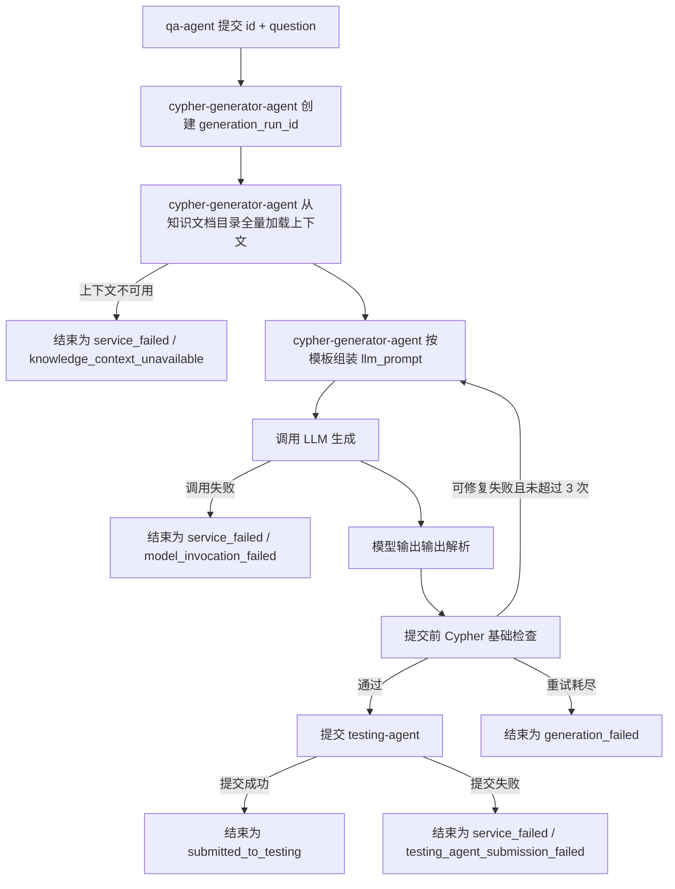
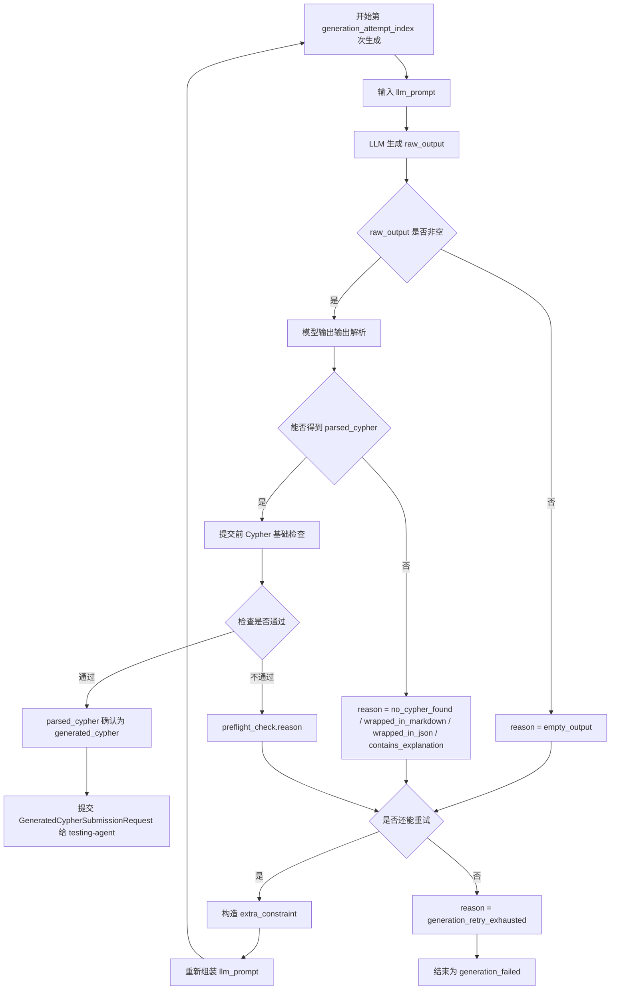

# cypher-generator-agent 架构设计

`cypher-generator-agent` 是 Text2Cypher 闭环中的 Cypher 生成执行器。

它的任务不是维护知识，也不是评测答案，而是在收到一个问题后，读取配置的知识文档目录，消费 knowledge-agent 维护的正式知识文件，构造一次稳定的 LLM 调用，让大模型尽可能直接产出一条可用的只读 Cypher，并把生成证据提交给 testing-agent。

cypher-generator-agent 不向 qa-agent 回传生成结果、评测状态或失败状态。qa-agent 只负责发起生成请求，不消费 cypher-generator-agent 或 testing-agent 的执行结果来改变自身状态。cypher-generator-agent 的正式下游输出是提交给 testing-agent 的 `GeneratedCypherSubmissionRequest`。

```text
cypher-generator-agent 负责“生成一条可提交评测的 Cypher”；
testing-agent 判断“这条 Cypher 是否可执行、是否答对”。
```

cypher-generator-agent 的目标输出标准是：

- 生成结果必须是一条 Cypher 查询
- cypher-generator-agent 只检查输出形态、基础 Cypher 语法形态和只读安全
- cypher-generator-agent 不评判 Cypher 是否业务正确，也不判断 schema、返回结果或问题语义是否对齐

## 1. 术语与核心数据结构

本章先定义 cypher-generator-agent 文档中反复出现的数据结构。后续流程与责任边界都以这些对象为基础。

### 1.1 QA 样本与 `id`

`id` 是一条 QA 样本在闭环中的主键。它由 qa-agent 提供，贯穿 cypher-generator-agent、testing-agent 和 repair-agent。

cypher-generator-agent 接收同一个 `id` 时，只把它作为问题标识透传给 testing-agent。

### 1.2 `QAQuestionRequest`

`QAQuestionRequest` 表示 qa-agent 向 cypher-generator-agent 提交的一次生成请求。

它包含：

| 字段 | 含义 |
| --- | --- |
| `id` | QA 样本主键，用于和后续 testing-agent 评测记录对齐 |
| `question` | 原始自然语言问题，是本次 Cypher 生成目标 |

它的意义是：告诉 cypher-generator-agent“这道题是什么，以及需要围绕哪个问题生成 Cypher”。

### 1.3 `ko_context`

`ko_context` 表示 cypher-generator-agent 从配置的知识文档目录全量加载并拼装出的 Cypher 生成知识背景。

全量加载 v1 中，cypher-generator-agent 直接读取 knowledge-agent 维护的正式知识文档目录，并把固定文件集合拼装为 `ko_context`。它不依赖外部提示词接口。

它是 LLM 生成 Cypher 时需要参考的背景材料。自然语言问题通常只描述“想查什么”，但不会稳定说明：

- 图谱里有哪些节点 label、关系类型和属性。
- 业务词汇应该映射到哪些图谱结构。
- 当前系统允许或推荐使用哪些查询模式。
- 类似问题过去应该如何写 Cypher。
- 有哪些查询约束、命名习惯或业务规则需要遵守。

它的意义是：为 LLM 生成提供 schema、业务规则、few-shot 和查询约束。cypher-generator-agent 不编辑这些知识，也不判断这些知识是否业务正确；cypher-generator-agent 只读取并消费这些知识，并在外层补充生成任务和输出格式要求。

### 1.4 cypher-generator-agent LLM Prompt 组装模板

cypher-generator-agent 在 `ko_context` 外层构造的最终模型输入模板。实际产物就是本轮喂给 LLM 的 `llm_prompt`。

cypher-generator-agent 需要这个模板，是因为 `ko_context` 的职责是提供 Cypher 生成所需的知识背景，而不是保证 LLM 的最终输出形态。知识文档上下文可能包含 schema、业务规则、示例、解释性文字，甚至可能包含与当前输出契约不一致的格式要求。cypher-generator-agent 如果直接把知识文档上下文原样喂给 LLM，就会出现几个问题：

- LLM 可能跟随知识文档上下文中的解释性文字，输出分析过程而不是 Cypher。
- LLM 可能跟随示例格式，输出 JSON、Markdown 代码块或多段说明。
- LLM 可能不清楚当前调用的下游消费者是 testing-agent，因此不知道结果必须是一条可提交评测的查询。
- 当知识文档上下文中的输出要求和 cypher-generator-agent 当前运行要求冲突时，模型缺少明确的优先级依据。
- 自我修复重试时，模型需要知道上一次失败的是输出形态、只读安全还是基础语法形态，而这些反馈不属于 knowledge-agent 知识。

因此，cypher-generator-agent LLM Prompt 组装模板承担的是“最终 prompt 组装”职责：把用户问题、知识文档背景、输出格式、优先级和可选的额外约束组织成一次稳定的 LLM 调用。它不新增 schema，不改写业务规则，不替代 knowledge-agent 的知识维护职责；它只规定这次调用中模型应该如何使用上下文、应该输出什么、以及发生冲突时听谁的。

这个模板是 cypher-generator-agent 内部固定、完备、版本化的系统模板，不属于业务修复闭环中的可修复知识。后续业务迭代的对象是 knowledge-agent 维护的知识文件，也就是 `ko_context` 的来源内容；如果发现 cypher-generator-agent LLM Prompt 组装模板、输出解析或提交前 Cypher 基础检查本身不合理，那是 cypher-generator-agent 工程实现缺陷，需要通过工程变更处理，而不是由 repair-agent 生成补丁或由 knowledge-agent 在业务知识包中修复。

一个裁剪后的最终 prompt 示例见 [cypher-generator-agent-llm-prompt-example.md](/Users/mangowmac/Desktop/code/NL2Cypher/services/cypher_generator_agent/docs/reference/cypher-generator-agent-llm-prompt-example.md)。该示例展示了 `question + ko_context + 固定输出约束 + 优先级规则` 被组装成 `llm_prompt` 的完整形态。后续实验复盘时，优先替换该 Markdown 中的 `【知识文档上下文】` 段落。

它包含：

| 部分 | 含义 |
| --- | --- |
| 任务说明 | 告诉 LLM 当前任务是生成一条只读 Cypher |
| 用户问题 | 原始 `question`，明确本次生成目标 |
| 知识文档上下文 | `ko_context`，提供 schema、业务规则和示例 |
| 输出格式 | 要求模型只输出一条 Cypher，不输出 Markdown、JSON、解释或代码块 |
| 优先级 | 当知识文档上下文中的输出格式和 cypher-generator-agent 模板冲突时，以 cypher-generator-agent 模板为准；当业务知识与查询语义有关时，仍以知识文档上下文为准 |
| 额外约束 | 可选段落，仅在第二次或第三次生成时出现，要求模型在本次无状态调用中额外注意一个确定性问题 |

`extra_constraint` 是 cypher-generator-agent 在重试时追加到 `llm_prompt` 末尾的可选段落。第一次生成时没有该段落。

每一次 LLM 调用都是无状态的独立请求，模型不会天然保留上一轮生成上下文。因此 `extra_constraint` 不要求模型回忆上一轮输出，而是由 cypher-generator-agent 根据上一轮检查失败的 `reason` 选择一条固定约束文案。它不由 LLM 生成，也不是 cypher-generator-agent 临时写出的自由分析。

它的生成方式是：

```text
GenerationFailure.reason
  -> 选择固定额外约束文案
  -> 渲染为下一轮 llm_prompt 的【额外约束】段落
```

固定 `reason` 及其约束文案由 `GenerationFailure` 统一定义，见 [1.8 `GenerationFailure`](#18-generationfailure)。这里的 `GenerationFailure.reason` 可以来自输出解析失败，也可以来自提交前 Cypher 基础检查失败。LLM Prompt 组装模板只引用该定义，不在 prompt 模板章节单独维护一份映射表。

渲染进 prompt 时使用：

```text
【额外约束】
{reason 对应的固定额外约束文案}
```

它的意义是：把“知识背景”和“生成任务”分开。knowledge-agent 负责维护当前图谱和业务语境的正式知识文件；cypher-generator-agent 负责读取这些文件并告诉模型本次运行要产出一条什么形态的 Cypher。这样可以减少后续从 `raw_output` 中输出解析 Cypher 的成本，也能让模型在重试时针对具体格式或语法问题重新生成。

### 1.5 `generation_run_id` 与 `generation_attempt_index`

`generation_run_id` 是 cypher-generator-agent 为一次生成执行创建的运行标识。

`generation_attempt_index` 是 cypher-generator-agent 在同一次请求内部进行自我修复时使用的生成轮次，从 1 开始，最大为 3。

它们的边界是：

- `generation_run_id` 标识 cypher-generator-agent 的一次执行。
- `generation_attempt_index` 标识这次执行内部的第几轮 LLM 生成。
- 它们都不是 testing-agent 的 `attempt_no`。

`attempt_no` 由 testing-agent 在接收 submission 后分配和维护，用于评测记录、IssueTicket 和改进评估。

### 1.6 模型输出对象

cypher-generator-agent 会区分三个生成结果概念：

| 字段 | 含义 |
| --- | --- |
| `raw_output` | LLM 原始输出 |
| `parsed_cypher` | 从 `raw_output` 直接确认出的 Cypher 文本，准备进入提交前检查 |
| `generated_cypher` | 通过 cypher-generator-agent 提交前 Cypher 基础检查、可以提交给 testing-agent 的 Cypher |

这三个对象必须分开，是因为它们代表不同的责任阶段：

- `raw_output` 是模型事实。它回答“模型到底返回了什么”，不能被解析、清洗或提交前检查结果覆盖。
- `parsed_cypher` 是 cypher-generator-agent 输出解析后的结果。它回答“cypher-generator-agent 是否能把模型输出直接确认为 Cypher”，但还不能代表可提交结果。
- `generated_cypher` 是通过提交前 Cypher 基础检查后的正式生成结果。它回答“cypher-generator-agent 最终允许提交给 testing-agent 的是什么”。

如果不区分这三层，后续失败分析会混在一起。例如，testing-agent 执行失败时，需要知道失败是模型直接生成了错误 Cypher，还是提交前 Cypher 基础检查放行了不该放行的候选查询。只有保留三层对象，才能追溯每一步的责任边界，并避免把 cypher-generator-agent 工程链路问题误判成 knowledge-agent 知识缺口。

这三个对象也影响重试策略。`raw_output` 为空、输出不能被确认为 Cypher、`parsed_cypher` 未通过提交前 Cypher 基础检查时，cypher-generator-agent 都使用同一个 `reason` 表达失败原因。这个 `reason` 会贯穿检查结果、额外约束和最终失败记录。只有 `generated_cypher` 才能提交 testing-agent。

它的意义是：把“模型说了什么”“cypher-generator-agent 是否能确认它是 Cypher”“最终能提交什么”分开，让内部生成排障、输出解析归因、提交前 Cypher 基础检查和后续失败分析各自有清楚的事实来源。`raw_output`、`parsed_cypher`、`parse_summary` 和 `preflight_check` 属于 cypher-generator-agent 内部运行事实，用于自身工程排障与归因；repair-agent 在正式闭环中消费的是 testing-agent 问题单里的最小 `generation_evidence`，而不是这条内部解析链路的完整对象。

### 1.7 cypher-generator-agent -> testing-agent 契约

cypher-generator-agent 通过 `GeneratedCypherSubmissionRequest` 向 testing-agent 提交生成结果和生成证据。

这个跨服务契约需要与 `services/testing_agent/docs/testing-agent-design.md` 中的同名契约保持一致。submission 只保留 testing-agent、repair-agent 和运行中心回放真正需要的最小生成证据；cypher-generator-agent 不承担落盘职责，所有需要回看的生成证据都必须随跨服务契约提交给 testing-agent，由 testing-agent 统一持久化和对外查询。

它包含：

| 字段 | 含义 |
| --- | --- |
| `id` | QA 样本主键，用于 testing-agent 与 golden answer 对齐 |
| `question` | 原始自然语言问题，供评测和 issue ticket 使用 |
| `generation_run_id` | cypher-generator-agent 本次执行标识，供问题追踪和证据串联 |
| `generated_cypher` | cypher-generator-agent 认为可提交评测的 Cypher |
| `input_prompt_snapshot` | 最终 LLM 输入快照。它主要供 repair-agent 分析 knowledge-agent 知识包、few-shot 和上下文是否诱发失败；其中 cypher-generator-agent LLM Prompt 组装模板是固定系统包装，不作为 repair-agent 修复目标 |
| `last_llm_raw_output` | 最后一次生成尝试的大模型原始输出。它用于运行中心回放“模型最后说了什么”，不参与 testing-agent 主评测打分 |
| `generation_retry_count` | cypher-generator-agent 为得到可提交 Cypher 额外重试的次数。首次生成即通过时为 `0` |
| `generation_failure_reasons` | 本次生成过程中累计失败原因列表，只保留固定 reason，不保存每次重试的完整 prompt |

`parse_summary` 和完整 `preflight_check` 仍然是 cypher-generator-agent 内部生成链路里的运行事实，不进入 submission 契约。运行中心只需要展示最终是否通过生成门禁以及未通过原因；这些事实可由 `generation_failure_reasons` 与最终状态表达，不要求保存每个检查项的细节。

`attempt_no` 不属于 cypher-generator-agent 的职责。cypher-generator-agent 是单纯的生成服务，不记录“这是第几次评测尝试”。testing-agent 在接收 submission 后，根据同一 `id` 的已有记录分配并维护 `attempt_no`。

### 1.7.1 cypher-generator-agent -> testing-agent 生成失败上报契约

当 cypher-generator-agent 没有得到可提交 testing-agent 评测的 `generated_cypher` 时，也需要把失败事实提交给 testing-agent 持久化，否则运行中心无法回放生成阶段失败样本。

该契约独立于成功 submission，命名为 `GenerationRunFailureReport`。它仍然由 cypher-generator-agent 发给 testing-agent，testing-agent 负责落盘和对外展示。

字段：

| 字段 | 含义 |
| --- | --- |
| `id` | 问题标识，用于和 golden answer、运行中心任务对齐 |
| `question` | 原始自然语言问题 |
| `generation_run_id` | cypher-generator-agent 本次执行标识 |
| `input_prompt_snapshot` | 最后一次生成尝试使用的完整 LLM 输入快照 |
| `last_llm_raw_output` | 最后一次生成尝试的大模型原始输出；如果模型调用从未成功，可为空 |
| `generation_status` | `generation_failed` 或 `service_failed` |
| `failure_reason` | 固定失败原因，来自 `GenerationFailure.reason` 或 `ServiceFailure.reason` |
| `last_generation_failure_reason` | 如果最终原因是 `generation_retry_exhausted`，记录最后一次可重试生成失败原因 |
| `generation_retry_count` | 额外重试次数 |
| `generation_failure_reasons` | 本次累计失败原因列表，只保留 reason，不保存每轮完整 prompt |
| `parsed_cypher` | 最后一次可解析出的 Cypher；如果没有可识别 Cypher，可为空 |
| `gate_passed` | 最后一次生成门禁是否通过；生成失败场景通常为 `false` |

testing-agent 接收该报告后，需要按 `generation_status` 区分工程失败与生成失败：

- 工程失败：如 `knowledge_context_unavailable`、`model_invocation_failed`，说明本轮没有完成一次有效生成尝试。testing-agent 只持久化失败事实，不构造正式评测 attempt，也不进入 repair-agent。`testing_agent_submission_failed` 表示 cypher-generator-agent 已经准备好要提交给 testing-agent 的 payload，但同步投递失败；该 payload 必须进入 cypher-generator-agent 本地可靠投递 outbox，等待 testing-agent 恢复后继续补投，不能只写运行日志后丢弃。
- 生成失败：如 `no_cypher_found`、`wrapped_in_markdown`、`contains_explanation`、`multiple_statements`、`unbalanced_brackets`、`unclosed_string`、`write_operation`、`unsupported_call`、`unsupported_start_clause`。这类失败说明 LLM 已经基于知识文档上下文尝试生成，但输出未通过 cypher-generator-agent 门禁。testing-agent 需要把它转成一次正式失败 attempt：grammar 记为 0，不进入数据库执行、strict compare 或 semantic review，但仍计算 GLEU 与 Jaro-Winkler similarity，并在 `verdict=fail` 后生成 IssueTicket，供 repair-agent 判断是否缺少知识。
- `generation_retry_exhausted` 是生成物失败的汇总状态，必须结合 `last_generation_failure_reason` 与 `generation_failure_reasons` 判断。

### 1.8 `GenerationFailure`

`GenerationFailure` 表示 LLM 已经进入生成流程，但模型输出没有通过 cypher-generator-agent 的输出解析或提交前 Cypher 基础检查。

它只描述“生成物哪里不符合提交前检查”，不描述知识上下文不可用、LLM 调用异常或 testing-agent 提交失败这类服务链路问题。

它包含：

| 字段 | 含义 |
| --- | --- |
| `reason` | 固定生成失败原因，例如 `unbalanced_brackets` 或 `generation_retry_exhausted` |
| `last_reason` | 可选字段。仅在 `reason` 为 `generation_retry_exhausted` 时出现，表示最后一次可重试生成失败原因 |

它的意义是：让 cypher-generator-agent 在内部重试、生成证据和运行排障时使用同一套生成失败原因，避免检查结果、额外约束和最终失败记录各自定义一套错误表达。

固定生成失败 `reason` 及其约束文案如下：

| `reason` | 含义 | 是否可通过重新生成修复 | 追加到 prompt 的额外约束 |
| --- | --- | --- | --- |
| `empty_output` | 模型没有返回任何内容，或只返回空白 | 是 | 必须输出一条完整的只读 Cypher。 |
| `no_cypher_found` | 模型有输出，但其中没有可识别的 Cypher 查询 | 是 | 只输出 Cypher 查询本体。 |
| `wrapped_in_markdown` | 查询被 Markdown 或代码块包住 | 是 | 不要使用 Markdown 或代码块包装查询。 |
| `wrapped_in_json` | 查询被 JSON 结构包住 | 是 | 不要使用 JSON 包装查询。 |
| `contains_explanation` | 输出中混入解释、标题或自然语言说明 | 是 | 不要输出解释、标题或自然语言说明。 |
| `multiple_statements` | 输出了多条 Cypher 语句 | 是 | 只输出一条 Cypher 查询。 |
| `unbalanced_brackets` | 圆括号、方括号或花括号没有闭合 | 是 | 确保圆括号、方括号和花括号完整闭合。 |
| `unclosed_string` | 字符串引号没有闭合 | 是 | 确保字符串引号完整闭合。 |
| `write_operation` | 查询包含写入、删除或修改操作 | 是 | 只生成只读查询。 |
| `unsupported_call` | 使用了未允许的 `CALL` procedure | 是 | 不要使用未允许的 `CALL` procedure。 |
| `unsupported_start_clause` | 查询不是以允许的只读起始子句开始 | 是 | 使用 `MATCH` 或 `WITH` 作为查询起始子句。 |
| `generation_retry_exhausted` | 3 次生成后仍未得到通过提交前 Cypher 基础检查的 Cypher | 否 | 不适用 |

其中，除 `generation_retry_exhausted` 外，其他生成失败 `reason` 都可以转成下一轮 prompt 的 `【额外约束】`。`generation_retry_exhausted` 只作为最终失败原因返回，不再追加到 prompt。

### 1.9 `ServiceFailure`

`ServiceFailure` 表示 cypher-generator-agent 没有完成一次正常生成流程，失败来自依赖服务、配置、模型调用链路或下游提交链路。

它包含：

| 字段 | 含义 |
| --- | --- |
| `reason` | 固定服务失败原因，例如 `knowledge_context_unavailable` |

固定服务失败 `reason` 如下：

| `reason` | 含义 | 是否进入 LLM 自我修复重试 |
| --- | --- | --- |
| `knowledge_context_unavailable` | 无法从配置的知识文档目录加载上下文，或上下文为空到无法构造生成调用 | 否 |
| `model_invocation_failed` | LLM 调用失败、超时，或没有产生可读取响应 | 否 |
| `testing_agent_submission_failed` | 已得到 `generated_cypher`，但提交 testing-agent 失败 | 否 |

服务失败 `reason` 不会追加到 prompt。它们不是模型输出质量问题，重新生成不能直接修复。

---

## 2. 主流程

### 2.1 总览



cypher-generator-agent 内部最多进行 3 次生成尝试。这里的尝试是 cypher-generator-agent 内部为了得到可用 Cypher 的生成重试，不等同于 testing-agent 的 `attempt_no`。

每一步的意义：

| 步骤 | 输入 | 输出 | 意义 |
| --- | --- | --- | --- |
| 接收请求 | `QAQuestionRequest` | `generation_run_id` | 建立一次生成执行上下文 |
| 全量加载知识文档上下文 | `id`、`question`、`knowledge_docs_dir` | `ko_context` 或 `service_failed` | 从配置目录读取 schema、业务规则、few-shot 和查询约束；上下文不可用时本次运行结束为服务失败 |
| 按模板组装 `llm_prompt` | `question`、`ko_context`、可选 `extra_constraint` | `llm_prompt` | 按固定模板填入问题、上下文、输出格式、优先级和额外约束 |
| 调用 LLM | `llm_prompt` | `raw_output` 或 `service_failed` | 让模型生成原始回答；调用失败时本次运行结束为服务失败 |
| 输出解析 | `raw_output` | `parsed_cypher`、`parse_summary` 或 `reason` | 把模型输出转成可检查的 Cypher 文本 |
| 提交前 Cypher 基础检查 | `parsed_cypher` | `generated_cypher` 或 `preflight_check.reason` | 检查非空、单条语句、只读安全、支持的起始子句和明显语法形态 |
| 自我修复重试 | 上次失败的 `GenerationFailure.reason` | 新一轮 `llm_prompt` | 根据固定生成失败 reason 追加 `【额外约束】` 后重新生成 |
| 提交 testing-agent | `generated_cypher` 和生成证据 | `accepted = true` 或 `service_failed` | 将生成结果提交给 testing-agent；`accepted = true` 只表示 submission 已被接收，后续评测由 testing-agent 在其内部链路继续完成 |

---

## 3. 分步数据流

本章中的“输出”和“内部运行结果记录”描述 cypher-generator-agent 内部数据流，不代表 `POST /api/v1/qa/questions` 会向 qa-agent 返回业务响应体。对外接口的响应边界见 [4.1 生成入口](#41-生成入口)。

### Step 1: 接收生成请求

意义：

建立一次 cypher-generator-agent 生成执行上下文。cypher-generator-agent 在这一刻只确认“有一个问题需要生成 Cypher”，不读取既有评测记录、不分配 `attempt_no`。

输入：

```json
{
  "id": "qa-001",
  "question": "查询所有协议版本对应的隧道名称"
}
```

输出：

```json
{
  "id": "qa-001",
  "question": "查询所有协议版本对应的隧道名称",
  "generation_run_id": "cypher-run-7b6d9d"
}
```

字段含义：
`generation_run_id` 为 cypher-generator-agent 本次执行的唯一标识。


### Step 2: 全量加载知识文档上下文

意义：

cypher-generator-agent 不编辑知识。所有 schema、业务规则、示例和领域约束都来自 knowledge-agent 维护的正式知识文件。

全量加载 v1 的上下文来源是配置项 `CYPHER_GENERATOR_AGENT_KNOWLEDGE_DOCS_DIR` 指向的文件目录，线上预期为 `/root/multi-agent/knowledge-agent/backend/knowledge`。cypher-generator-agent 不调用外部提示词接口。

cypher-generator-agent 每次生成请求实时读取以下必需文件：

```text
schema.json
system_prompt.md
cypher_syntax.md
business_knowledge.md
few_shot.md
```

不读取：

```text
_history/
backup 目录
临时文件
其它未知文件
```

全量加载 v1 不按 `id` 或 `question` 做检索、筛选、chunk、embedding 或重排。`id` 和 `question` 在本步骤只用于日志、排障和后续按需检索扩展。

cypher-generator-agent 读取本地知识文件：

```json
{
  "id": "qa-001",
  "question": "查询所有协议版本对应的隧道名称",
  "knowledge_docs_dir": "/root/multi-agent/knowledge-agent/backend/knowledge"
}
```

cypher-generator-agent 在内部把这些文件按固定顺序拼装为 `ko_context`：

````json
{
  "ko_context": "# System Prompt\n...\n\n# Schema\n```json\n...\n```\n\n# Cypher Syntax\n...\n\n# Business Knowledge\n...\n\n# Few-shot Examples\n..."
}
````

字段含义：

| 字段 | 含义 |
| --- | --- |
| `knowledge_docs_dir` | knowledge-agent 正式知识文件所在目录。cypher-generator-agent 只读该目录下的固定文件集合 |
| `ko_context` | cypher-generator-agent 从正式知识文件全量拼装出的知识上下文。它是上下文材料，不是最终完整 prompt |

拼装顺序固定为：

1. `system_prompt.md`
2. `schema.json`
3. `cypher_syntax.md`
4. `business_knowledge.md`
5. `few_shot.md`

v1 选择每次请求实时读磁盘，不做启动时缓存。理由是当前知识文件很小，实时读取可以让人工修改知识文档后在下一次生成请求立即生效，并避免第一版引入缓存失效、mtime 检测或 reload 接口。

内部运行结果记录：

```json
{
  "generation_status": "service_failed",
  "error": {
    "reason": "knowledge_context_unavailable"
  }
}
```

说明：

`knowledge_context_unavailable` 属于 `service_failed`。它不是 LLM 可修复原因，不进入生成重试，也不会追加到 prompt。

全量加载 v1 中，它表示“生成知识上下文不可用”，包括目录不存在、必需文件缺失、文件不可读、文件为空或 `schema.json` 不是合法 JSON。

### Step 3: 按模板组装 `llm_prompt`

意义：

知识文档上下文是业务和 schema 背景，cypher-generator-agent 不能假设它已经稳定表达了“模型应该如何输出”。因此 cypher-generator-agent 需要把 `question`、`ko_context` 和可选 `extra_constraint` 填入固定的 LLM Prompt 组装模板，得到本次实际喂给模型的 `llm_prompt`。

这个模板不是知识加工，也不重复维护 knowledge-agent 的 schema 或业务规则。它只规定 LLM 这次调用的任务边界和输出格式。

输入：

````json
{
  "question": "查询所有协议版本对应的隧道名称",
  "ko_context": "# System Prompt\n...\n\n# Schema\n```json\n...\n```\n\n# Cypher Syntax\n...\n\n# Business Knowledge\n...\n\n# Few-shot Examples\n...",
  "extra_constraint": null
}
````

输出：

```json
{
  "llm_prompt": "【任务说明】...\n【用户问题】...\n【知识文档上下文】...\n【输出格式】...\n【优先级】..."
}
```

模板结构：

```text
【任务说明】
你是 cypher-generator-agent 的 Cypher 生成器。你的任务是基于用户问题和知识文档上下文生成一条只读 Cypher 查询。

【用户问题】
{question}

【知识文档上下文】
{ko_context}

【输出格式】
只输出一条 Cypher 查询本体。
不要输出 Markdown、代码块、JSON、解释、标题或自然语言说明。
查询应以 MATCH 或 WITH 开头；只有在 cypher-generator-agent 明确允许只读 procedure 白名单时，才可以使用 CALL。
查询必须是单条语句。

【优先级】
如果知识文档上下文中的输出格式要求与本模板冲突，以本模板为准。
如果知识文档上下文中的业务知识与用户问题有关，按知识文档上下文理解业务语义。
cypher-generator-agent 只要求输出可用的只读 Cypher，不要求你解释推理过程。
```

具体 prompt 示例见 [cypher-generator-agent-llm-prompt-example.md](/Users/mangowmac/Desktop/code/NL2Cypher/services/cypher_generator_agent/docs/reference/cypher-generator-agent-llm-prompt-example.md)。设计文档正文只保留模板结构，避免把完整知识文档上下文塞进主文档。这个 Markdown 是后续实验内容替换的维护点。

字段含义：

| 字段 | 含义 |
| --- | --- |
| `question` | 用户问题，帮助模型明确当前生成目标 |
| `ko_context` | 从知识文档目录全量加载并拼装出的知识上下文，负责业务和 schema 信息 |
| `extra_constraint` | 第二次或第三次生成时追加的额外约束。它由上一轮固定 `reason` 选择，只描述输出形态、只读安全或基础语法形态问题 |
| `llm_prompt` | 最终喂给 LLM 的完整输入 |

### Step 4: 调用 LLM

意义：

cypher-generator-agent 把组装后的 `llm_prompt` 交给模型，要求模型直接返回 Cypher。

输入：

```json
{
  "generation_run_id": "cypher-run-7b6d9d",
  "generation_attempt_index": 1,
  "llm_prompt": "【任务说明】...\n【用户问题】...\n【知识文档上下文】..."
}
```

输出：

```json
{
  "raw_output": "MATCH (p:Protocol)-[:HAS_TUNNEL]->(t:Tunnel) RETURN p.version, t.name"
}
```

字段含义：

| 字段 | 含义 |
| --- | --- |
| `raw_output` | LLM 原始输出。理想情况下它本身就是 Cypher |

内部运行结果记录：

```json
{
  "generation_status": "service_failed",
  "error": {
    "reason": "model_invocation_failed"
  }
}
```

说明：

模型调用失败不是模型输出可修复错误，不进入 3 次生成重试。

### Step 4.1: 生成、解析、检查与自我修复链路

这段链路只处理 LLM 输出到 `generated_cypher` 的转换过程。它不判断业务语义，不检查 label、关系、属性是否存在，也不连接 TuGraph 做 dry-run。

在这条链路中，cypher-generator-agent 只处理自己能确定性判断的生成物问题：

| 处理点 | cypher-generator-agent 判断什么 | 输出 |
| --- | --- | --- |
| Step 5 输出解析 | 模型输出是否能被直接确认为一条 Cypher | `parsed_cypher`、`parse_summary` 或固定 `reason` |
| Step 6 提交前 Cypher 基础检查 | 解析得到的 Cypher 是否非空、单条、只读，并且没有明显括号或字符串残缺 | `generated_cypher` 或 `preflight_check.reason` |
| Step 7 自我修复重试 | 上述 `reason` 是否可以通过重新生成修复 | 新一轮 `llm_prompt` 或 `generation_retry_exhausted` |

schema 对齐、业务正确性和结果正确性不在这条链路中判断。它们需要图谱 schema、TuGraph 执行结果和 golden answer，由 testing-agent 负责。



这张图里的每个对象含义如下：

| 对象 | 含义 |
| --- | --- |
| `raw_output` | LLM 原始返回内容，可能是 Cypher，也可能是空、解释、Markdown、JSON 或混合文本 |
| `parsed_cypher` | 从 `raw_output` 直接确认出的 Cypher 文本，还不能提交 testing-agent |
| `generated_cypher` | 通过提交前 Cypher 基础检查后的正式生成物，可以随证据提交给 testing-agent |
| `preflight_check` | 提交前 Cypher 基础检查结果。失败时只给出一个固定 `reason` |
| `extra_constraint` | 下一轮生成使用的额外约束，由本轮失败 `reason` 选择固定文案 |

输出解析只解决“模型是否严格按格式直接输出 Cypher”的问题。Markdown 代码块、JSON 包装或带说明文字的输出都会被记录为固定失败原因，并进入自我修复重试。

提交前 Cypher 基础检查只做确定性校验，不调用 LLM。检查内容包括非空、单条语句、支持的起始子句、只读安全、括号闭合和字符串闭合。它的作用是决定 `parsed_cypher` 能不能成为 `generated_cypher`，不证明这条查询业务正确。

自我修复重试只处理 cypher-generator-agent 可观察、可反馈给模型的输出问题。知识文档上下文不可用、LLM 调用失败、testing-agent 提交失败不进入这条重试链路。

### Step 5: 模型输出解析

意义：

模板要求模型直接输出 Cypher，所以正常路径不需要“提取”。这一层只是保险措施，用于确认模型是否严格只输出一条 Cypher；Markdown fence、JSON 或附带说明都会作为失败原因进入自我修复重试。

输入：

```json
{
  "raw_output": "MATCH (p:Protocol) RETURN p.version"
}
```

输出：

```json
{
  "parsed_cypher": "MATCH (p:Protocol) RETURN p.version",
  "parse_summary": "direct_cypher"
}
```

`parse_summary` 取值：

| 值 | 含义 |
| --- | --- |
| `direct_cypher` | `raw_output` 本身就是以 `MATCH`、`WITH` 或 `CALL` 开头的 Cypher |
| `failed` | 模型输出无法被严格确认为一条可检查的 Cypher；具体原因见固定 `reason` |

步骤失败输出：

```json
{
  "parse_summary": "failed",
  "reason": "wrapped_in_markdown"
}
```

输出解析失败时使用同一组固定 `reason`：

| `reason` | 含义 |
| --- | --- |
| `empty_output` | 模型没有返回任何内容，或只返回空白 |
| `no_cypher_found` | 模型有输出，但其中没有可识别的 Cypher 查询 |
| `wrapped_in_markdown` | 查询被 Markdown 或代码块包住 |
| `wrapped_in_json` | 查询被 JSON 结构包住 |
| `contains_explanation` | 输出中混入解释、标题或自然语言说明 |

这些失败属于可修复问题，可以进入下一轮生成重试。重试时不会把整段 `raw_output` 放入 prompt，只会根据 `reason` 追加一条固定 `【额外约束】`。

### Step 6: 提交前 Cypher 基础检查

意义：

cypher-generator-agent 只关心生成结果是否“可用”。这里的可用指基础语法形态和只读安全，不代表业务正确。

输入：

```json
{
  "parsed_cypher": "MATCH (p:Protocol)-[:HAS_TUNNEL]->(t:Tunnel) RETURN p.version, t.name"
}
```

检查内容：

| 检查项 | 通过条件 | 失败 `reason` |
| --- | --- | --- |
| 非空 | Cypher 去空白后不为空 | `empty_output` |
| 单条语句 | 不包含多条独立语句 | `multiple_statements` |
| 支持的起始子句 | 以 `MATCH`、`WITH` 开头；`CALL` 只有命中只读白名单时允许 | `unsupported_start_clause` 或 `unsupported_call` |
| 只读安全 | 不包含 `CREATE`、`MERGE`、`DELETE`、`SET`、`REMOVE`、`DROP` 等写操作 | `write_operation` |
| 括号闭合 | `()`、`[]`、`{}` 基础配对完整 | `unbalanced_brackets` |
| 字符串闭合 | 单引号和双引号没有明显未闭合 | `unclosed_string` |

单条语句初版规则：

1. 允许一个尾随分号，例如 `MATCH (n) RETURN n;`。
2. 不允许字符串和注释外出现多个分号。
3. 单引号、双引号内的分号不作为语句分隔符。
4. `// ...` 和 `/* ... */` 注释中的分号不作为语句分隔符。
5. 如果去掉尾随分号后仍检测到语句分隔符，则判定为多语句。

`CALL` 初版规则：

cypher-generator-agent 将 `CALL` 视为高风险起始子句。第一版只允许命中只读 procedure 白名单的 `CALL` 查询；如果没有配置白名单，则 `CALL` 默认拒绝，`reason` 为 `unsupported_call`。

这条规则的意义是：避免 cypher-generator-agent 在不了解 TuGraph procedure 副作用的情况下放行可能写入、修改或管理数据库的过程调用。需要数据库侧 procedure 能力时，应先在 testing-agent 或配置层明确只读白名单。

成功输出：

```json
{
  "generated_cypher": "MATCH (p:Protocol)-[:HAS_TUNNEL]->(t:Tunnel) RETURN p.version, t.name",
  "preflight_check": {
    "accepted": true
  }
}
```

步骤失败输出：

```json
{
  "preflight_check": {
    "accepted": false,
    "reason": "unbalanced_brackets"
  }
}
```

说明：

cypher-generator-agent 不在这里检查 label 是否存在、关系是否正确、属性是否正确、返回字段是否符合预期。这些属于 testing-agent 的评测范围。

### Step 7: 自我修复重试

意义：

如果模型已经产出了内容，但内容没有通过输出约束或提交前 Cypher 基础检查，cypher-generator-agent 可以根据固定 `reason` 选择一条额外约束，重新组装完整 `llm_prompt` 再调用模型。这样可以提高“至少可提交给 testing-agent 评测”的成功率。

最大次数：

```json
{
  "max_generation_attempts": 3
}
```

可重试 `reason`：

| `reason` | 额外约束 |
| --- | --- |
| `empty_output` | 必须输出一条完整的只读 Cypher。 |
| `no_cypher_found` | 只输出 Cypher 查询本体。 |
| `wrapped_in_markdown` | 不要使用 Markdown 或代码块包装查询。 |
| `wrapped_in_json` | 不要使用 JSON 包装查询。 |
| `contains_explanation` | 不要输出解释、标题或自然语言说明。 |
| `multiple_statements` | 只输出一条 Cypher 查询。 |
| `unbalanced_brackets` | 确保圆括号、方括号和花括号完整闭合。 |
| `unclosed_string` | 确保字符串引号完整闭合。 |
| `write_operation` | 只生成只读查询。 |
| `unsupported_call` | 不要使用未允许的 `CALL` procedure。 |
| `unsupported_start_clause` | 使用 `MATCH` 或 `WITH` 作为查询起始子句。 |

知识文档上下文不可用、LLM 调用失败和 testing-agent 提交失败属于 `ServiceFailure.reason`，不会进入自我修复重试。

重试输入：

```json
{
  "question": "查询所有协议版本对应的隧道名称",
  "ko_context": "你需要根据以下图谱结构生成 Cypher...",
  "extra_constraint": "确保圆括号、方括号和花括号完整闭合。"
}
```

渲染进 prompt 时：

```text
【额外约束】
确保圆括号、方括号和花括号完整闭合。
```

内部运行结果记录：

```json
{
  "generation_status": "generation_failed",
  "error": {
    "reason": "generation_retry_exhausted",
    "last_reason": "unbalanced_brackets"
  }
}
```

### Step 8: 提交 testing-agent

意义：

cypher-generator-agent 自己不存储生成证据。只要 Cypher 通过提交前 Cypher 基础检查，cypher-generator-agent 就把生成结果和证据提交给 testing-agent，由 testing-agent 负责持久化、分配 `attempt_no` 和后续评测。

cypher-generator-agent 提交：

```json
{
  "id": "qa-001",
  "question": "查询所有协议版本对应的隧道名称",
  "generation_run_id": "cypher-run-7b6d9d",
  "generated_cypher": "MATCH (p:Protocol)-[:HAS_TUNNEL]->(t:Tunnel) RETURN p.version, t.name",
  "input_prompt_snapshot": "【任务说明】...\n【用户问题】...\n【知识文档上下文】...",
  "last_llm_raw_output": "MATCH (p:Protocol)-[:HAS_TUNNEL]->(t:Tunnel) RETURN p.version, t.name",
  "generation_retry_count": 0,
  "generation_failure_reasons": []
}
```

字段含义：

| 字段 | 含义 |
| --- | --- |
| `id` | 问题标识，用于 testing-agent 与 golden answer 对齐 |
| `question` | 原始自然语言问题，供评测和 issue ticket 使用 |
| `generation_run_id` | cypher-generator-agent 本次执行标识，供问题追踪和证据串联 |
| `generated_cypher` | cypher-generator-agent 认为可提交评测的 Cypher |
| `input_prompt_snapshot` | 最终 LLM 输入快照。这个字段的作用是支持 repair-agent 分析 knowledge-agent 知识包、few-shot 和上下文是否诱发失败；cypher-generator-agent LLM Prompt 组装模板部分是固定系统模板，不作为业务修复目标；testing-agent 只保存和转交，不据此评分 |
| `last_llm_raw_output` | 最后一次生成尝试的大模型原始输出，用于运行中心回放 |
| `generation_retry_count` | 额外重试次数，首次生成即通过时为 `0` |
| `generation_failure_reasons` | 本次累计失败原因列表，只保留固定 reason，不保存每轮完整 prompt |

testing-agent 返回：

```json
{
  "accepted": true
}
```

字段含义：

| 字段 | 含义 |
| --- | --- |
| `accepted` | 表示 testing-agent 已成功接收该 submission |

到这里，cypher-generator-agent 的主流程结束。testing-agent 的返回值只用于 cypher-generator-agent 确认下游已接收提交；它不作为 qa-agent 的输入，也不回传给 qa-agent 驱动状态变化。

如果提交 testing-agent 失败，cypher-generator-agent 不重新调用 LLM，也不重新生成 Cypher。提交失败只重试下游提交，避免同一个 `id` 因下游短暂故障产生多条不同 Cypher。

提交失败必须具备可靠投递语义：同步重试耗尽后，cypher-generator-agent 要把同一份待提交 payload 写入本地 durable outbox，并由后台任务继续补投。outbox 是交付可靠性机制，不是正式评测数据源；payload 最终仍应由 testing-agent 接收、落盘并提供给运行中心查询。testing-agent 明确接收成功后，cypher-generator-agent 必须删除 outbox 中对应记录，不保留第二份长期副本。

提交失败重试规则：

| 条件 | 是否重试 | 说明 |
| --- | --- | --- |
| 网络连接失败 | 是 | 使用同一份 `GeneratedCypherSubmissionRequest` 重试提交，不重新生成 Cypher |
| 请求超时 | 是 | 使用同一份 payload 重试，避免重复调用 LLM |
| testing-agent 5xx | 是 | 视为下游临时不可用 |
| testing-agent 409 | 否 | 视为 submission 冲突，需要人工或上游处理 |
| testing-agent 4xx，非 409 | 否 | 视为契约错误或请求非法，不应盲目重试；该失败需要保留为不可补投 outbox 记录供排障 |

同步提交重试最多 3 次，包括第一次提交。3 次后仍失败，cypher-generator-agent 本次运行结束为 `service_failed`，`reason` 为 `testing_agent_submission_failed`，但待提交 payload 必须已经进入 outbox。后台补投期间记录保持 `pending` 或 `retrying`，不得删除 payload；一旦补投收到 testing-agent 的明确接收确认，必须删除对应 outbox 记录。

outbox 记录至少包含：

| 字段 | 含义 |
| --- | --- |
| `delivery_id` | 本地投递记录 ID |
| `payload_type` | `GeneratedCypherSubmissionRequest` 或 `GenerationRunFailureReport` |
| `id` | QA 样本 ID |
| `generation_run_id` | cypher-generator-agent 本次运行 ID |
| `payload` | 原始待提交 payload，必须可完整重放 |
| `status` | `pending`、`retrying`、`dead_letter`；投递成功后删除记录，不保留 `delivered` 长期状态 |
| `attempt_count` | 已补投次数 |
| `last_error` | 最近一次投递失败原因 |
| `next_retry_at` | 下次补投时间 |

补投必须使用同一份 payload 和稳定幂等键，避免 testing-agent 恢复后产生重复 attempt。删除 outbox 记录的前提是 testing-agent 已返回明确接收确认；如果本地删除失败，后台任务必须能够重试清理，不能影响 testing-agent 已完成的正式落盘。

---

## 4. 对外接口

本章说明 cypher-generator-agent 对外暴露的正式接口规格。主流程和分步数据流先定义服务如何工作；本章只保留目标架构下仍属于 cypher-generator-agent 职责边界的接口。

### 4.1 生成入口

`POST /api/v1/qa/questions`

这是 cypher-generator-agent 的正式外部入口。请求体只保留问题生成所需的最小输入。

该接口的业务契约只定义请求，不定义承载生成结果的响应体。cypher-generator-agent 不把 `generated_cypher`、`generation_status`、`preflight_check` 或 testing-agent 的接收回执返回给 qa-agent。生成结果和生成证据只提交给 testing-agent；失败原因只用于 cypher-generator-agent 自身日志、运行观测和工程排障。

```json
{
  "id": "qa-001",
  "question": "查询所有协议版本对应的隧道名称"
}
```

字段含义：

| 字段 | 类型 | 含义 |
| --- | --- | --- |
| `id` | string | 问题的稳定标识。cypher-generator-agent 只透传该标识，不用它分配尝试编号 |
| `question` | string | 用户自然语言问题。cypher-generator-agent 会把它传给 LLM Prompt 组装模板；全量加载 v1 中不使用它筛选知识 |

响应体：

```text
无业务响应体。
```

如果当前 HTTP 实现必须返回内容，也只能返回传输层确认信息，不能把它作为 qa-agent 的业务输入。目标架构中，qa-agent 不根据 cypher-generator-agent 的成功、失败或 testing-agent 提交结果改变自身状态。

### 4.2 健康与配置检查接口

`GET /health`

用于服务存活检查，只返回 cypher-generator-agent 自身状态。

```json
{
  "status": "ok",
  "service": "cypher-generator-agent"
}
```

`GET /api/v1/generator/status`

用于排查 cypher-generator-agent 当前生成依赖是否配置完整。它只表达服务自身配置与依赖可用性，不返回单次生成运行状态、生成记录、`generated_cypher`、`preflight_check` 或 testing-agent 提交结果。

全量加载 v1 中，状态接口暴露知识上下文来源为 `file_docs`，并显示知识文档目录是否已配置。

```json
{
  "llm_enabled": true,
  "llm_provider": "openai_chat",
  "llm_model": "qwen-plus",
  "active_mode": "llm",
  "knowledge_context_source": "file_docs",
  "knowledge_docs_dir_configured": true,
  "testing_agent_configured": true
}
```

### 4.3 运行配置

全量加载 v1 使用知识文档目录配置：

| 配置项 | 含义 |
| --- | --- |
| `CYPHER_GENERATOR_AGENT_KNOWLEDGE_DOCS_DIR` | knowledge-agent 正式知识文件目录。线上预期值为 `/root/multi-agent/knowledge-agent/backend/knowledge` |

该目录必须包含：

```text
schema.json
system_prompt.md
cypher_syntax.md
business_knowledge.md
few_shot.md
```

---

## 5. 运行结果模型

cypher-generator-agent 一次运行只有三类最终结果。运行结果只用于自身日志、运行观测和工程排障，不作为 qa-agent 的输入。

| 运行结果 | 含义 | `reason` | 后续动作 |
| --- | --- | --- | --- |
| `submitted_to_testing` | 已生成一条通过提交前 Cypher 基础检查的 Cypher，并成功提交 testing-agent | 无 | 主流程结束，后续执行和评测由 testing-agent 负责 |
| `generation_failed` | LLM 已进入生成流程，但 3 次内没有得到通过提交前 Cypher 基础检查的 Cypher | `GenerationFailure.reason` | 主流程结束，失败记录用于运行观测和工程排障 |
| `service_failed` | cypher-generator-agent 没有完成一次正常生成流程，失败来自依赖服务、配置、LLM 调用链路或 testing-agent 提交链路 | `ServiceFailure.reason` | 主流程结束；如果原因是 `testing_agent_submission_failed`，待提交 payload 必须留在 outbox 等待补投 |

`reason` 与重试关系：

| 运行结果 | `reason` 归属 | 是否追加到 prompt | 是否进入重试 |
| --- | --- | --- | --- |
| `submitted_to_testing` | 无 | 否 | 否 |
| `generation_failed` | `GenerationFailure.reason` | 可重试生成失败会追加固定 `【额外约束】`；`generation_retry_exhausted` 不追加 | 可重试生成失败最多进入 3 次生成尝试；耗尽后结束为失败 |
| `service_failed` | `ServiceFailure.reason` | 否 | 否 |

固定生成失败 `reason`、含义、是否可重试以及额外约束文案由 [1.8 `GenerationFailure`](#18-generationfailure) 定义。固定服务失败 `reason` 由 [1.9 `ServiceFailure`](#19-servicefailure) 定义。

---

## 6. 运行状态

运行状态描述 cypher-generator-agent 内部执行阶段。它们用于日志和排障，不表示业务评测状态，也不替代 testing-agent 的 `EvaluationState`。

| 阶段 | 输入 | 输出 | 意义 |
| --- | --- | --- | --- |
| `received` | `QAQuestionRequest` | `generation_run_id` | 建立本次生成执行上下文 |
| `ko_context_ready` | `id`、`question`、`knowledge_docs_dir` | `ko_context` | 从知识文档目录全量加载生成上下文 |
| `prompt_built` | `question`、`ko_context`、可选 `extra_constraint` | `llm_prompt` | 按固定模板组装最终 LLM 输入；重试时追加 `【额外约束】` |
| `model_generated` | `llm_prompt` | `raw_output` | 获得模型原始输出 |
| `parsed` | `raw_output` | `parsed_cypher`、`parse_summary` | 得到提交前检查所需的 Cypher 文本 |
| `preflight_checked` | `parsed_cypher` | `generated_cypher`、`preflight_check` | 确认可提交评测 |
| `submitted` | `GeneratedCypherSubmissionRequest` | `accepted = true` | testing-agent 已接收生成结果 |

---

## 7. 后续演进清单

本节只记录和 cypher-generator-agent 收束相关的后续工作。已经在本文档中确定的事项，不再作为开放设计问题处理。

### 7.1 已在本文档中完成的澄清

| 事项 | 当前状态 | 后续动作 |
| --- | --- | --- |
| 明确 cypher-generator-agent 不评判业务正确性 | 已在开篇定位和 [Step 4.1](#step-41-生成解析检查与自我修复链路) 中说明 | 后续实现不要引入 schema、结果或业务语义评测 |
| 明确 cypher-generator-agent 不做 TuGraph dry-run | 已在开篇定位和 [Step 4.1](#step-41-生成解析检查与自我修复链路) 中说明 | TuGraph 执行和数据库侧检查归 testing-agent |
| 明确 `attempt_no` 归属 testing-agent | 已在术语和 Step 8 中说明 | cypher-generator-agent 只保留内部 `generation_attempt_index` |
| 明确知识文档上下文不是最终 prompt | 已在 `ko_context` 和 LLM Prompt 组装模板中说明 | cypher-generator-agent 只包装任务和输出格式，不编辑 knowledge-agent 知识 |

### 7.2 文档已确定，可以按文档重构实现

| 事项 | 文档依据 | 实现目标 |
| --- | --- | --- |
| 引入 cypher-generator-agent LLM Prompt 组装模板 | [1.4](#14-cypher-generator-agent-llm-prompt-组装模板)、[Step 3](#step-3-按模板组装-llm_prompt) | 用 `question + ko_context + 输出格式 + 优先级` 组装最终 LLM 输入 |
| 将模型输出处理改为输出解析 | [1.6](#16-模型输出对象)、[Step 5](#step-5-模型输出解析) | 使用确定性规则确认模型是否只输出一条 Cypher |
| 实现提交前 Cypher 基础检查 | [Step 6](#step-6-提交前-cypher-基础检查) | 只检查输出契约、基础语法形态和只读安全 |
| 实现最多 3 次自我修复 | [Step 7](#step-7-自我修复重试)、[5. 运行结果模型](#5-运行结果模型) | 仅对可修复的模型输出错误重试 |
| 引入文件知识上下文 provider | [1.3](#13-ko_context)、[Step 2](#step-2-全量加载知识文档上下文) | 使用 `CYPHER_GENERATOR_AGENT_KNOWLEDGE_DOCS_DIR` 全量读取正式知识文件 |

### 7.3 已补齐初版规则，仍需实现验证

| 事项 | 初版规则 | 后续动作 |
| --- | --- | --- |
| `CALL` 只读安全规则 | `CALL` 只有命中只读 procedure 白名单时允许；没有白名单时默认拒绝 | 实现时需要提供配置项或明确禁用 `CALL` |
| 单条语句判断细则 | 允许一个尾随分号；忽略字符串和注释内分号；字符串/注释外多个分号判定为多语句 | 实现轻量 lexer，并用用例覆盖尾随分号、字符串分号、注释分号、多语句 |
| testing-agent 提交失败可靠投递 | 同步提交最多 3 次；只重试网络失败、超时和 5xx；不重新生成 Cypher；同步重试耗尽后写入 durable outbox 并后台补投 | 实现本地 outbox、幂等投递键、后台补投和 dead-letter 排障状态 |

这些规则已经足够进入代码设计，但还需要在实现时用测试锁定边界。特别是单条语句判断不应使用简单字符串 `split(";")`，否则会误伤字符串字面量和注释内容。

## 8. 结论

cypher-generator-agent 的核心设计应该保持克制：

```text
它负责把 id + question 变成一条通过提交前基础语法形态与只读安全检查的 Cypher；
它不负责判断这条 Cypher 是否答对问题。
```

因此，cypher-generator-agent 的输出不是“正确答案”，而是“可交给 testing-agent 验证的生成结果”。知识由 knowledge-agent 维护，评测由 testing-agent 完成，repair-agent 只面向 knowledge-agent 知识包生成修复建议；cypher-generator-agent 固定 Prompt 模板、输出解析和提交前 Cypher 基础检查的缺陷属于工程问题，不进入业务知识修复闭环。
