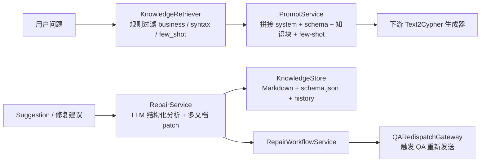
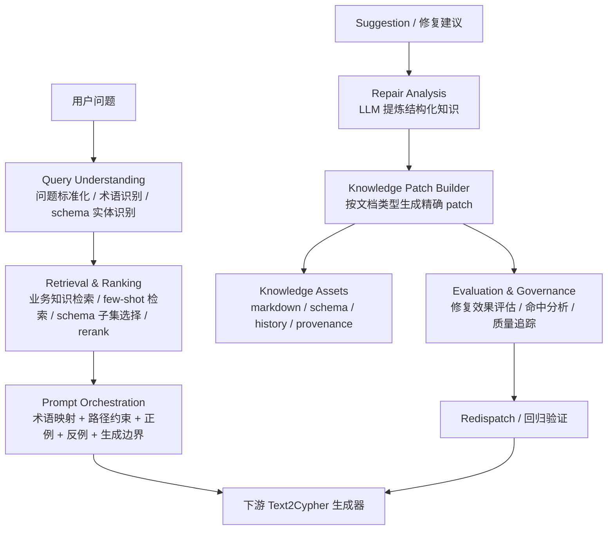

# Knowledge-Agent 职责架构对比

## 目的

这份文档用于说明 `knowledge-agent` 当前职责边界，以及参考业界 Text2Cypher / RAG / 知识治理实践后，更推荐的职责划分方式。

目标不是否定当前实现，而是帮助我们更清楚地回答两个问题：

1. 当前 `knowledge-agent` 已经在承担什么职责
2. 如果要让“同一个问题在别人拿到知识后，也能更稳定地产出正确 Cypher”，还应该补哪些职责层

---

## 当前职责架构

当前系统更像一个：

`知识文档管理 + Prompt 拼装 + Suggestion 修复回写 + QA 重新派发`



### 当前模块职责

| 模块 | 当前职责 |
|---|---|
| `KnowledgeStore` | 存取 `schema / cypher_syntax / few_shot / system_prompt / business_knowledge`，并维护 history |
| `KnowledgeRetriever` | 按问题做轻规则过滤，挑选业务知识和示例 |
| `PromptService` | 将 schema、业务知识、few-shot、系统提示词拼成最终 prompt |
| `RepairService` | 将 suggestion 通过 LLM 分析后，写回多个知识文档 |
| `RepairWorkflowService` | 串联 repair 与 redispatch |
| `QARedispatchGateway` | 通知下游重新获取知识并重试 |

### 当前架构的优点

- 已经形成了完整的“知识更新 -> 下游重试”闭环
- 知识以 markdown 形式可读、可版本化、可审计
- 已经开始把 LLM 用在 suggestion 的结构化知识提炼上，而不是只做字符串追加

### 当前架构的主要缺口

- 缺少独立的 `问题理解 / 问题标准化` 层
- 缺少独立的 `检索排序 / rerank` 层
- 缺少独立的 `评估与治理` 层
- `system_prompt`、`business_knowledge`、`few_shot` 的职责还存在部分混用

---

## 推荐职责架构

参考更成熟的 Text2Cypher / RAG 实践，`knowledge-agent` 更适合升级为：

`Text2Cypher 知识编排器`

它不只是“存知识和拼 prompt”，而是负责：

- 问题理解
- 相关知识检索
- few-shot 排序
- Prompt 编排
- Suggestion 驱动的知识修复
- 修复效果评估与治理



---

## 当前职责 vs 推荐职责

| 职责层 | 当前是否具备 | 当前实现情况 | 推荐增强方向 |
|---|---|---|---|
| Knowledge Assets | 是 | 已有 markdown + schema + history | 增加 provenance、效果标签、质量标签 |
| Query Understanding | 否 | 基本缺失 | 增加 QueryRewrite / 实体识别 / 术语标准化 |
| Retrieval | 部分具备 | 轻规则过滤 | 增加 typed retrieval 与 rerank |
| Prompt Orchestration | 是 | 已有 prompt 拼装 | 继续结构化、减少原文堆叠 |
| Knowledge Repair | 是 | 已升级为 LLM 分析后多文档写入 | 增加 patch 置信度、冲突检测 |
| Evaluation & Governance | 否 | 仅有日志和 history | 增加修复前后效果评估、命中分析、错误归因 |

---

## 推荐的模块边界

### 1. Knowledge Assets

负责知识本体，而不是生成逻辑。

包含：

- `schema.json`
- `cypher_syntax.md`
- `business_knowledge.md`
- `few_shot.md`
- `system_prompt.md`
- `_history/*`

建议补充：

- `provenance`
- `effectiveness score`
- `last used / last matched`

---

### 2. Query Understanding

职责是把原始自然语言问题变成更适合检索和生成的标准形式。

建议承担：

- 问题标准化
- 术语归一化
- query intent 识别
- schema 实体识别

输出形态建议：

```json
{
  "normalized_question": "查询协议版本为v2.0的隧道所属网元",
  "intent": "lookup_owner_by_protocol_version",
  "terms": ["协议版本", "隧道所属网元"],
  "schema_candidates": ["Protocol.version", "NetworkElement", "Tunnel"]
}
```

---

### 3. Retrieval & Ranking

职责不是“找到一些文本”，而是“挑出最值得进入 prompt 的知识”。

建议分成：

- `business knowledge retrieval`
- `cypher syntax retrieval`
- `few-shot retrieval`
- `schema slice selection`
- `reranker`

推荐产物：

```json
{
  "business_hits": [...],
  "syntax_hits": [...],
  "few_shot_hits": [...],
  "schema_slice": [...],
  "ranking_reason": "question matches protocol-version + owner-path pattern"
}
```

---

### 4. Prompt Orchestration

职责是把知识组织成**对模型最有帮助的形式**，而不是简单堆叠原文。

推荐保留这些结构块：

- `Schema`
- `术语映射`
- `关键路径与过滤约束`
- `正例示例`
- `反例提醒`
- `生成要求`

当前这部分已经做得不错，后续主要优化方向是：

- 控制 prompt 冗余
- 让 few-shot 更精准
- 让 constraints 更像 checklist 而不是原文摘抄

---

### 5. Knowledge Repair

职责是把 suggestion 变成未来可复用知识。

推荐稳定为两段：

1. `Repair Analysis`
   - 由 LLM 生成结构化知识分析
2. `Patch Builder`
   - 由程序把分析变成多文档 patch

这样比直接 patch 更稳，因为它把：

- 问题模式
- schema 绑定
- 路径约束
- 正/反例

显式提炼出来了。

---

### 6. Evaluation & Governance

这是当前最缺的一层，也是业界系统里最容易被低估的一层。

建议承担：

- suggestion 修复前后对比
- 命中的知识块记录
- redispatch 是否改善
- 同类问题是否更稳定
- patch 冲突或覆盖检测

如果没有这一层，系统会越来越大，但很难回答：

“哪条知识真的有用？”

---

## 业界实践映射

### Text2Cypher

Neo4j 官方实践强调：

- schema 要增强
- few-shot 要动态检索
- 要有 validation / correction loop

这说明 `knowledge-agent` 不应只负责文档存取，还应该更强地负责：

- query rewrite
- few-shot selection
- correction support

### RAG

成熟 RAG 架构通常拆成：

- query optimization
- retrieval
- reranking
- response orchestration
- evaluation

这和推荐职责架构是一致的。

### 知识治理

企业知识系统通常不会只问“知识有没有写进去”，而会继续问：

- 知识是否被命中
- 是否帮助了最终生成
- 是否与旧知识冲突

这对应我们建议增加的 `Evaluation & Governance`。

---

## 最值得优先补的职责

如果只优先补 3 个，我建议顺序是：

1. `Query Understanding`
2. `Retrieval & Ranking`
3. `Evaluation & Governance`

原因：

- 没有 `Query Understanding`，知识检索容易命中不稳
- 没有 `Retrieval & Ranking`，few-shot 和约束容易选错
- 没有 `Evaluation & Governance`，修知识只能靠感觉

---

## 一句话总结

当前 `knowledge-agent` 已经是一个能工作的“知识管理与回写器”；  
更成熟的目标形态，应当是一个：

**面向 Text2Cypher 的知识编排与治理中枢**

它的核心职责，不只是“保存知识”，而是：

- 让问题先被理解
- 让知识被正确检索
- 让 prompt 被更合理编排
- 让 suggestion 真正变成可复用知识
- 让修复效果被持续评估
