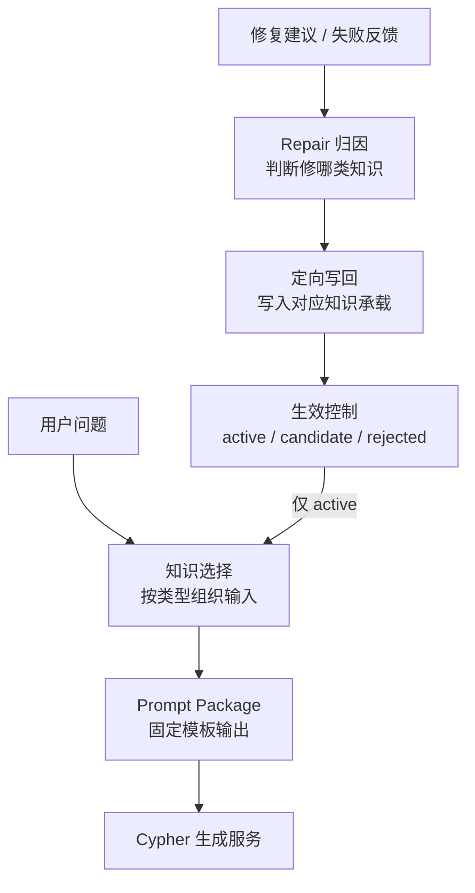
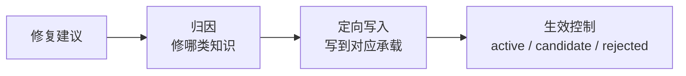

# Text2Cypher Knowledge-Agent 方案

## 1. 总体方案

当前 `knowledge-agent` 最接近的可靠定位，不是“完整知识平台”，而是：

`按知识类型管理的 prompt 装配器 + 受控的 repair 回写器`

这个定位直接受当前实现边界约束：

1. 对外稳定暴露的只有 `prompt-package` 和 `repair/apply` 两条主流程。
   代码依据：[main.py](/Users/wangxinhao/muti-agent-offline-system/knowledge-agent/backend/app/entrypoints/api/main.py:167)
2. 当前检索是规则过滤，不是独立检索服务、语义召回或 rerank。
   代码依据：[retriever.py](/Users/wangxinhao/muti-agent-offline-system/knowledge-agent/backend/app/domain/knowledge/retriever.py:11)
3. 当前知识底座是 `schema.json + markdown 文件 + _history`，不是资产治理平台。
   代码依据：[knowledge_store.py](/Users/wangxinhao/muti-agent-offline-system/knowledge-agent/backend/app/storage/knowledge_store.py:15)

因此，新方案不假设已有完整知识平台，而是在现有骨架上做两件事：

1. 把知识从“按文档堆积”改成“按作用分型管理”。
2. 把 repair 从“直接追加”改成“先归因、再定向写入、最后受控生效”。

推荐架构如下：

图中需要特别说明：

1. `candidate` 只入库待审，不进入后续 prompt。
2. repair 默认解决“当前查询如何修正”，不是默认自动沉淀长期知识。

这个架构的依据主要来自四类事实：

1. Text2Cypher 直接证据支持：生成时需要显式处理 `schema / values / examples / rules`，而不是只喂一份混合文本。
   论文依据：[Mind the Query](https://aclanthology.org/2025.emnlp-industry.133.pdf), [CypherBench](https://aclanthology.org/2025.acl-long.438.pdf)
2. 工业实践支持：输出给生成模型的应是收缩后的上下文，而不是全量知识原文。
   依据：[AWS + Cisco Enterprise NL2SQL](https://aws.amazon.com/blogs/machine-learning/enterprise-grade-natural-language-to-sql-generation-using-llms-balancing-accuracy-latency-and-scale/), [Neo4j Text2Cypher Guide](https://neo4j.com/blog/genai/text2cypher-guide/)
3. Text2SQL 直接证据支持：错误分类后再定向纠错，比粗放修复更稳。
   依据：[Multi-grained Error Identification](https://aclanthology.org/2025.coling-main.289/), [Text-to-SQL Error Correction](https://aclanthology.org/2023.acl-short.117/)
4. Text2Cypher 与工业实现都说明：自动验证不覆盖全部逻辑正确性，因此高风险更新不能默认直接生效。
   依据：[Mind the Query](https://aclanthology.org/2025.emnlp-industry.133.pdf), [Neo4j JDBC Text2Cypher](https://neo4j.com/docs/jdbc-manual/current/text2cypher/), [LangChain Security Policy](https://docs.langchain.com/oss/python/security-policy)

需要明确的边界：

1. `domain routing / entity resolution / schema slice` 是目标能力，不是当前实现能力。
2. `active / candidate / rejected` 是本方案的治理设计，不是论文结论。
3. “修复建议进入长期知识”必须与“当前查询被修好”严格分开。

---

## 2. 知识如何分类

### 分类原则

本方案按“知识在生成时起什么作用”来分类，而不按“当前存在哪个文件里”来分类。

这样做的原因是：

1. 文献支持的是不同类型上下文对生成作用不同，而不是固定文件结构。
   依据：[Mind the Query](https://aclanthology.org/2025.emnlp-industry.133.pdf)
2. 当前系统的问题正是同一文档混入多种职责，导致 repair 不知道该写哪里。
   代码依据：[repair_service.py](/Users/wangxinhao/muti-agent-offline-system/knowledge-agent/backend/app/domain/knowledge/repair_service.py:24)

### 分类方案

#### 2.1 Schema

是什么：

1. 标签、关系、属性、方向。
2. 返回对象相关的结构事实。

有什么：

1. `schema.json`
2. `cypher_syntax.md` 中与结构合法性相关的补充规则

为什么这么分：

1. Text2Cypher 的第一性约束是 schema grounding。
   依据：[Mind the Query](https://aclanthology.org/2025.emnlp-industry.133.pdf)
2. 生成器最少需要“当前可用的结构空间”，不能把结构事实混在 few-shot 或业务说明里。
   工业实现依据：[Neo4j Text2Cypher Template](https://neo4j.com/docs/neo4j-graphrag-python/current/_modules/neo4j_graphrag/generation/prompts.html)

如果不这么分，会有什么问题：

1. 结构事实只能散落在 few-shot 和业务文档里。
2. repair 很容易把“schema 解释问题”错写成“业务规则问题”。

#### 2.2 Value

是什么：

1. 枚举值。
2. 值别名。
3. 常见过滤值提示。

有什么：

1. 当前实现里没有独立 value 存储。
2. 第一阶段只能借道 `business_knowledge.md` 或 `few_shot.md` 承载，但必须标记其知识类型是 `value`。

为什么这么分：

1. 文献直接支持 schema 与 sampled values 分开处理。
   依据：[Mind the Query](https://aclanthology.org/2025.emnlp-industry.133.pdf)
2. 工业实践也强调把 example values、enumeration values 作为增强 schema 的一部分。
   依据：[Neo4j Text2Cypher Guide](https://neo4j.com/blog/genai/text2cypher-guide/), [LangChain Neo4j enhanced schema](https://docs.langchain.com/oss/python/integrations/graphs/neo4j_cypher)

如果不这么分，会有什么问题：

1. 值映射只能混在 few-shot 或业务描述里。
2. repair 无法区分“值错了”还是“结构错了”。

#### 2.3 Pattern / Example

是什么：

1. 典型路径。
2. 返回对象骨架。
3. 正例。
4. 可选反例提醒。

有什么：

1. 当前主要承载在 `few_shot.md`
2. 少量路径类规则也散落在 `cypher_syntax.md`

为什么这么分：

1. `CypherBench` 直接指出 graph pattern 是 Text2Cypher 关键难点。
   依据：[CypherBench](https://aclanthology.org/2025.acl-long.438.pdf)
2. `Mind the Query` 直接使用 category-specific few-shots。
   依据：[Mind the Query](https://aclanthology.org/2025.emnlp-industry.133.pdf)
3. 工业实践明确建议 few-shot 走相关性选择，而不是固定静态附录。
   依据：[Neo4j Text2Cypher Guide](https://neo4j.com/blog/genai/text2cypher-guide/)

为什么 pattern 和 example 先合并：

1. 当前实现没有独立 pattern 存储能力。
2. 第一阶段重点是“把 repair 写对地方”，不是重建知识平台。

如果不这么分，会有什么问题：

1. 模型只能从业务说明里猜路径。
2. 正例、反例和路径约束会继续混杂。

#### 2.4 Constraint

是什么：

1. 方言限制。
2. 禁止宽查询。
3. 返回列约束。
4. 不允许的查询写法。

有什么：

1. `cypher_syntax.md`
2. `system_prompt.md`

为什么这么分：

1. 这类知识解决的是“必须怎么写”，不是“应该查什么”。
2. 工业实现里的模板通常会把 schema、examples 和行为约束分开。
   依据：[Neo4j Text2Cypher Template](https://neo4j.com/docs/neo4j-graphrag-python/current/_modules/neo4j_graphrag/generation/prompts.html), [LangChain GraphCypherQAChain](https://docs.langchain.com/oss/python/integrations/graphs/neo4j_cypher)

如果不这么分，会有什么问题：

1. 方言和安全约束会被 few-shot 淹没。
2. repair 会继续把硬约束写进业务文案。

#### 2.5 Business Semantic

是什么：

1. 用户术语到 schema 的映射。
2. 业务口径。
3. 组织内习惯表达。

有什么：

1. 当前主要承载在 `business_knowledge.md`

为什么保留：

1. 这不是 Text2Cypher 论文中的强共识分类，但它是你当前 repair 场景中最常见的知识类型之一。
2. AWS/Cisco 的企业级 text-to-SQL 方案明确依赖 metadata、business rules 和 domain context。
   依据：[AWS + Cisco Enterprise NL2SQL](https://aws.amazon.com/blogs/machine-learning/enterprise-grade-natural-language-to-sql-generation-using-llms-balancing-accuracy-latency-and-scale/)

为什么要谨慎表述：

1. 这类知识应写成“当前业务场景下建议独立管理”，而不是“Text2Cypher 通用定论”。

如果不这么分，会有什么问题：

1. 在当前业务场景下，术语映射和口径说明更容易散落到 system prompt 或 few-shot。
2. 这会增加治理成本，并继续污染 schema、constraint 和 example 三层。

---

## 3. 如何修复、管理知识

### 3.1 修复原则

修复建议进入系统后，不应直接等价成长期知识。

更稳妥的原则是：

`先把当前查询修好，再判断其中哪些内容值得升格为长期知识。`

这条原则的依据非常明确：

1. Neo4j 的迭代修复流程支持“验证 -> 修正当前 Cypher”，但并不直接推出“自动沉淀长期知识”。
   依据：[Iterative Refinement for Text2Cypher](https://neo4j.com/blog/developer/iterative-refinement-for-text2cypher/)
2. Neo4j JDBC 的 `text2cypher` 建议先取回生成结果检查，再决定是否执行；它缓存的是自然语言到 Cypher 的翻译结果，不是长期知识条目。
   依据：[Neo4j JDBC Text2Cypher](https://neo4j.com/docs/jdbc-manual/current/text2cypher/)

### 3.2 修复流程

本方案推荐的 repair 只有三步：

#### 第一步：归因

每条 suggestion 应优先判断它在修哪类知识：

1. schema
2. value
3. pattern/example
4. constraint
5. business semantic

为什么这样设计：

1. Text2SQL 文献已经较清楚地支持“错误分类后再定向纠错”比粗放修复更合理。
   依据：[Multi-grained Error Identification](https://aclanthology.org/2025.coling-main.289/), [Text-to-SQL Error Correction](https://aclanthology.org/2023.acl-short.117/)
2. 当前实现虽然已有 `_infer_types`，但它只是关键词推断，不能当作可靠归因。
   代码依据：[repair_service.py](/Users/wangxinhao/muti-agent-offline-system/knowledge-agent/backend/app/domain/knowledge/repair_service.py:96)

如果无法可靠归因，就不允许自动进入有效知识，只保留为案例级修复记录或 `candidate`。

如果不这么设计，会有什么问题：

1. 所有修复都会继续被写进 few-shot 或 system prompt。
2. 长期知识会被一次性 patch 污染。

#### 第二步：定向写入

归因后只允许写入对应承载位置：

1. `business semantic` -> `business_knowledge.md`
2. `constraint` -> `cypher_syntax.md` / `system_prompt.md`
3. `pattern/example` -> `few_shot.md`
4. `value` -> 第一阶段借道 `business_knowledge.md` / `few_shot.md`

为什么这样设计：

1. 当前系统的可写知识类型只有四类，不能直接假设存在更细粒度知识库。
   代码依据：[models.py](/Users/wangxinhao/muti-agent-offline-system/knowledge-agent/backend/app/domain/models.py:8)
2. 所以第一阶段的目标不是“抽象最优”，而是“先写对地方”。

如果不这么设计，会有什么问题：

1. 当前 Markdown-first 存储无法承接新的知识分类。
2. 方案会脱离现有实现边界，落不了地。

#### 第三步：生效控制

修复写回后，建议引入三种状态：

1. `active`
2. `candidate`
3. `rejected`

为什么要有这个状态机：

1. 自动验证和自动修正当前查询，不等于可以把结果直接升级为长期知识。
   依据：[Mind the Query](https://aclanthology.org/2025.emnlp-industry.133.pdf), [CyVer](https://neo4j.com/blog/developer/verify-neo4j-cypher-queries-with-cyver/)
2. 当前实现里“写回后立即影响下次 prompt”是最大风险之一。
   代码依据：[repair_workflow_service.py](/Users/wangxinhao/muti-agent-offline-system/knowledge-agent/backend/app/domain/knowledge/repair_workflow_service.py:12)

建议规则：

1. 默认新知识先进入 `candidate`
2. 只有通过回放验证或人工审批的更新才可 `active`
3. 明显不可信的更新直接 `rejected`

这里要明确：

1. 这套状态机是工程治理设计，不是论文结论。
2. 它的目标是把“入库”与“进入 prompt”解耦。

### 3.3 如何管理知识

当前阶段不建议重建知识平台，而建议在现有文件知识库上加最小管理信息。

第一阶段最小必需字段建议只有：

1. `type`
2. `source`
3. `status`
4. `updated_at`

如果后续需要更强治理，再补充以下可选字段：

1. `origin_question`
2. `generated_query_or_example`
3. `schema_version_or_hash`
4. `reviewer`

为什么要这些字段：

1. 没有最小字段，就无法回答“它为什么存在、当前是否生效”。
2. 工业实现普遍保留 query history、querybook、审批痕迹或人工 inspection 痕迹。
   依据：[Neo4j JDBC Text2Cypher](https://neo4j.com/docs/jdbc-manual/current/text2cypher/), [AWS Generative SQL Querybook](https://docs.aws.amazon.com/sagemaker-unified-studio/latest/userguide/generative-sql.html)

### 3.4 哪些必须人工介入

当前版本建议强制人工介入的边界只有三类：

#### 1. 事实真源变更

包括：

1. schema 真实结构
2. 枚举真值
3. 业务口径定义

原因：

这类变更不是“生成辅助知识”，而是组织事实。

#### 2. 与既有知识冲突

包括：

1. 新旧术语映射冲突
2. 新旧路径解释冲突
3. 建议要求推翻高优先级规则

原因：

这类问题本质上是治理冲突，不是生成问题。

#### 3. 高风险写回相关

包括：

1. 多次失败后仍不稳定的修复
2. 影响多个 domain 的修复
3. 会显著扩大 prompt 范围的修复

原因：

这类更新一旦错误，影响面大。

需要明确：

1. 这些边界是当前版本的治理策略，不是固定行业标准。
2. 下游执行系统的写操作审批，不能混写成 knowledge-agent 自身已具备的能力。

---

## 4. 如何输出知识给 Cypher 生成服务

### 4.1 输出对象

当前阶段，knowledge-agent 对下游输出的对象仍然是 `prompt package`，而不是独立检索 API。

这由当前实现决定：

1. 当前 `PromptService` 负责组装最终 prompt 字符串。
   代码依据：[prompt_service.py](/Users/wangxinhao/muti-agent-offline-system/knowledge-agent/backend/app/domain/knowledge/prompt_service.py:15)

但新的输出原则应从“整篇文档拼接”改为“问题相关知识包”。

这里必须明确保守边界：

1. 第一阶段的“收缩”仅指基于现有规则过滤和知识类型筛选。
2. 它不包含向量检索、实体解析、domain routing、rerank，也不包含预训练、微调或重平台化改造。

### 4.2 输出内容

知识包的最小必备项应是：

1. `用户问题`
2. `受约束的 schema`
3. `少量相关的 pattern/example`
4. `显式 constraint`
5. `必要的 value / business mapping`

为什么这样设计：

1. Neo4j 官方模板的核心输入本来就是 `schema / examples / query_text`。
   依据：[Neo4j Text2Cypher Template](https://neo4j.com/docs/neo4j-graphrag-python/current/_modules/neo4j_graphrag/generation/prompts.html)
2. Neo4j JDBC 也明确把 graph schema 和输入问题一起发给模型。
   依据：[Neo4j JDBC Text2Cypher](https://neo4j.com/docs/jdbc-manual/current/text2cypher/)
3. 工业实践强调 schema 不只是 label 名，还应补充必要的 metadata、example values 和 business hints。
   依据：[Neo4j Text2Cypher Guide](https://neo4j.com/blog/genai/text2cypher-guide/), [AWS + Cisco Enterprise NL2SQL](https://aws.amazon.com/blogs/machine-learning/enterprise-grade-natural-language-to-sql-generation-using-llms-balancing-accuracy-latency-and-scale/)

如果不这样设计，会有什么问题：

1. 全文知识会把可执行约束和解释性文本混在一起。
2. 模型更容易幻觉出无关关系、无关属性和无关过滤。

### 4.3 输出组织方式

推荐沿用固定 section 模板，但按知识类型填充，而不是按文档全文填充。

推荐最小结构：

1. `Schema`
2. `术语映射`
3. `关键约束`
4. `正例`
5. `反例提醒（可选）`
6. `生成要求`
7. `用户问题`

为什么这样设计：

1. 这与当前 [prompt_service.py](/Users/wangxinhao/muti-agent-offline-system/knowledge-agent/backend/app/domain/knowledge/prompt_service.py:15) 最兼容。
2. 固定 section 有利于把“知识内容”和“行为约束”分开。
   依据：[Neo4j Text2Cypher Template](https://neo4j.com/docs/neo4j-graphrag-python/current/_modules/neo4j_graphrag/generation/prompts.html), [LangChain GraphCypherQAChain](https://docs.langchain.com/oss/python/integrations/graphs/neo4j_cypher)

### 4.4 输出前的收缩规则

知识输出前，建议至少控制以下五件事：

1. 允许输出哪些知识类型。
2. 每类最多多少条。
3. schema 片段如何裁剪。
4. 同类知识冲突时谁优先。
5. 是否允许原始枚举值和敏感元数据出包。

为什么必须写清：

1. 工业实践中，大 schema 和敏感元数据直接送给模型是明确风险。
   依据：[Neo4j JDBC Text2Cypher](https://neo4j.com/docs/jdbc-manual/current/text2cypher/), [Neo4j Text2Cypher Guide](https://neo4j.com/blog/genai/text2cypher-guide/)
2. 当前系统还没有 schema slice 和敏感裁剪能力，所以这部分必须作为新方案的新增规则写出来，而不能默认依赖现状。

### 4.5 一个必须保留的现实边界

当前实现还不能支持：

1. `domain routing`
2. `entity resolution`
3. `relevant schema slice`
4. `语义级相关性检索`

所以文档里所有“按相关性收缩知识包”的表述，都只能写成目标能力，不应写成现有能力。

代码依据：

1. [retriever.py](/Users/wangxinhao/muti-agent-offline-system/knowledge-agent/backend/app/domain/knowledge/retriever.py:11)
2. [prompt_service.py](/Users/wangxinhao/muti-agent-offline-system/knowledge-agent/backend/app/domain/knowledge/prompt_service.py:15)

---

## 引用链接

### Text2Cypher

1. [Mind the Query](https://aclanthology.org/2025.emnlp-industry.133.pdf)
2. [CypherBench](https://aclanthology.org/2025.acl-long.438.pdf)
3. [Auto-Cypher](https://arxiv.org/abs/2412.12612)
4. [Neo4j Text2Cypher Guide](https://neo4j.com/blog/genai/text2cypher-guide/)
5. [Neo4j JDBC Text2Cypher](https://neo4j.com/docs/jdbc-manual/current/text2cypher/)
6. [Iterative Refinement for Text2Cypher](https://neo4j.com/blog/developer/iterative-refinement-for-text2cypher/)
7. [CyVer](https://neo4j.com/blog/developer/verify-neo4j-cypher-queries-with-cyver/)
8. [Neo4j Text2Cypher Template Source](https://neo4j.com/docs/neo4j-graphrag-python/current/_modules/neo4j_graphrag/generation/prompts.html)

### Text2SQL / Industrial Borrowing

1. [AWS + Cisco Enterprise NL2SQL](https://aws.amazon.com/blogs/machine-learning/enterprise-grade-natural-language-to-sql-generation-using-llms-balancing-accuracy-latency-and-scale/)
2. [Multi-grained Error Identification](https://aclanthology.org/2025.coling-main.289/)
3. [Text-to-SQL Error Correction](https://aclanthology.org/2023.acl-short.117/)
4. [AWS Generative SQL Querybook](https://docs.aws.amazon.com/sagemaker-unified-studio/latest/userguide/generative-sql.html)
5. [LangChain GraphCypherQAChain](https://docs.langchain.com/oss/python/integrations/graphs/neo4j_cypher)
6. [LangChain Security Policy](https://docs.langchain.com/oss/python/security-policy)
