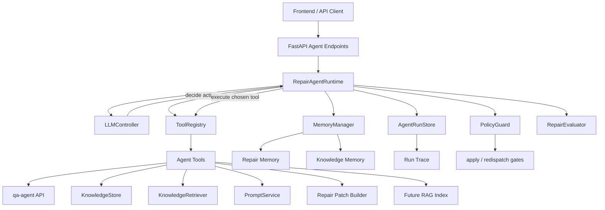
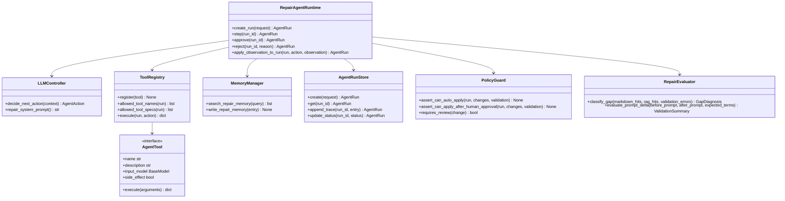
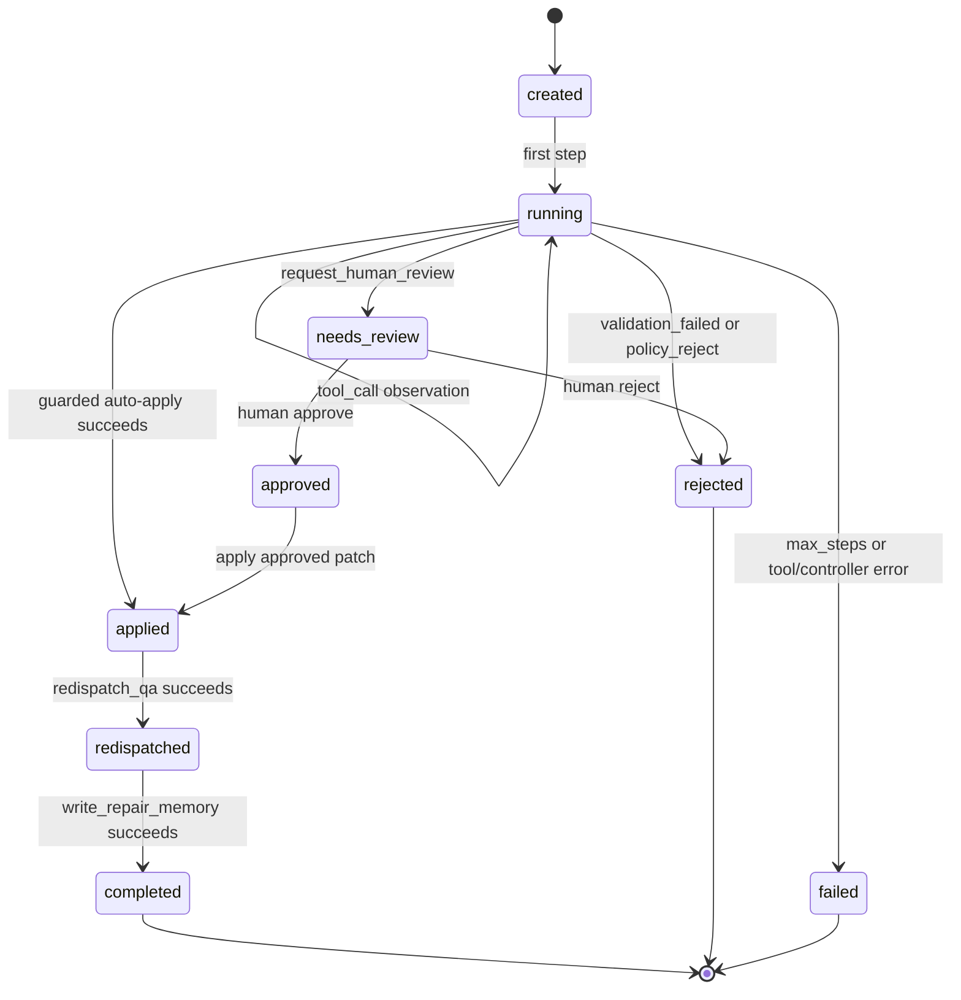
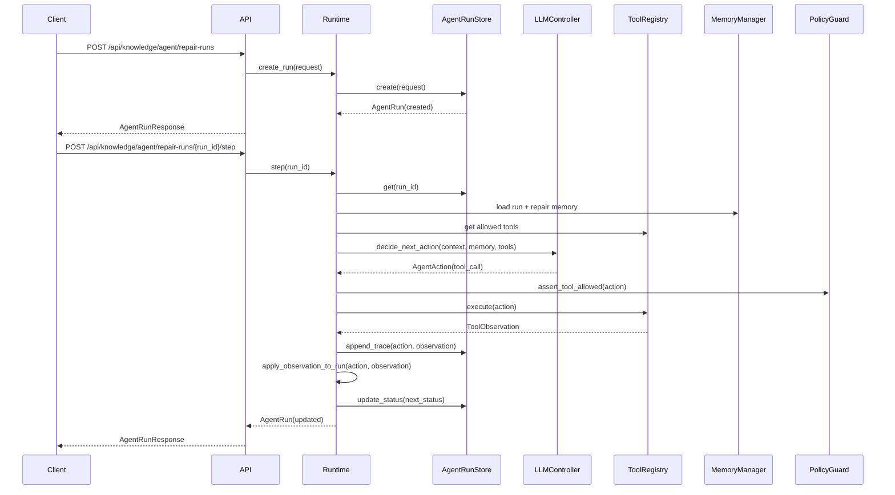

# Guarded Knowledge Repair Agent Design

## Purpose

This design upgrades the current `knowledge-agent` repair flow from a fixed workflow into a guarded agent.

The agent definition used here is:

- The LLM controller decides which tool to call next.
- The agent has retrieval ability over markdown knowledge and future RAG indexes.
- The agent has memory over the current run, historical repairs, and knowledge effectiveness.
- Engineering guardrails restrict unsafe writes, retries, and policy-sensitive actions.

The goal is not to replace deterministic validation. The goal is to let the model choose diagnostic and repair tools while the system keeps writes auditable and reversible.

## Current Baseline

Current repair behavior is effectively:

```text
ApplyRepairRequest(id, suggestion, knowledge_types)
  -> RepairService.apply()
  -> directly writes versioned markdown knowledge
  -> RepairWorkflowService redispatches the QA row
```

This is useful, but it cannot express agent decisions, retrieval misses, candidate-only patches, memory, or validation evidence.

## Target Behavior

The new flow is:

```text
failure case + known root cause + goal
  -> LLM chooses tools
  -> tools return observations
  -> observations become run trace and memory
  -> LLM continues until final / rejected / needs_review
  -> guarded apply only after policy and validation allow it
```

## Component UML



## Class UML



## State UML



## Sequence UML



## Agent Actions

The LLM controller must emit one of these structured actions:

The controller receives the available tool contracts as JSON, including each tool's name, description, and Pydantic JSON schema for arguments. The model therefore decides tool calls with an explicit argument contract rather than a bare tool-name list.

Side-effecting operations are not part of the default LLM tool allowlist. In V1, redispatch and repair-memory writes are runtime completion operations, not freely chosen model actions, unless an explicit future mode enables them with additional policy gates.

```json
{
  "action": "tool_call",
  "tool_name": "retrieve_knowledge",
  "arguments": {
    "query": "协议版本 隧道 所属网元 路径",
    "filters": {
      "knowledge_types": ["business_knowledge", "few_shot", "cypher_syntax"]
    }
  },
  "reason_summary": "确认现有知识中是否已有该路径规则"
}
```

```json
{
  "action": "request_human_review",
  "reason_summary": "候选路径规则会影响同类所属查询，需要人工确认"
}
```

```json
{
  "action": "final",
  "status": "ready_for_review",
  "summary": "候选 patch 已验证通过并写入记忆"
}
```

Free-form model text is not accepted as an action. Invalid output becomes a controller error and is recorded in the run trace. A `final` action cannot mark the run `completed`; it can only summarize the controller's current conclusion. Completion is set by the runtime after required side effects, such as approved apply, redispatch, and memory write, have finished.

## API Contracts

### Create Run

`POST /api/knowledge/agent/repair-runs`

```json
{
  "qa_id": "qa_001",
  "goal": "根据已知根因修复知识，并验证是否改善",
  "root_cause": {
    "type": "missing_path_rule",
    "summary": "协议版本过滤后没有返回所属网元",
    "suggested_fix": "补充 NetworkElement -> Tunnel -> Protocol 路径规则"
  },
  "constraints": {
    "auto_apply": false,
    "max_steps": 12,
    "allowed_tools": [
      "inspect_qa_case",
      "retrieve_knowledge",
      "rag_retrieve",
      "read_repair_memory",
      "classify_gap",
      "propose_patch",
      "check_duplicate",
      "check_conflict",
      "build_prompt_overlay",
      "evaluate_before_after"
    ]
  }
}
```

### Step Run

`POST /api/knowledge/agent/repair-runs/{run_id}/step`

Runs exactly one LLM decision and one chosen tool call. This is the default V1 execution mode because it is easy to debug and review.

### Approve / Reject

`POST /api/knowledge/agent/repair-runs/{run_id}/approve`

Applies the current approved candidate patch if policy allows it, then optionally redispatches the QA item.

`POST /api/knowledge/agent/repair-runs/{run_id}/reject`

Marks the run as rejected and writes a rejection memory entry.

## Tool Set

| Tool | Purpose | Writes Formal Knowledge |
|---|---|---|
| `inspect_qa_case` | Read QA details from `qa-agent` by `qa_id` | No |
| `retrieve_knowledge` | Retrieve related markdown knowledge blocks | No |
| `rag_retrieve` | Retrieve from the future RAG index | No |
| `read_repair_memory` | Retrieve similar historical repairs | No |
| `classify_gap` | Classify missing knowledge vs retrieval miss vs conflict | No |
| `propose_patch` | Build candidate changes only | No |
| `check_duplicate` | Detect duplicate candidate knowledge | No |
| `check_conflict` | Detect semantic or structural conflicts | No |
| `build_prompt_overlay` | Build prompt using candidate patch without writing files | No |
| `evaluate_before_after` | Compare before/after prompt and validation signals | No |
| `redispatch_qa` | Trigger QA redispatch in guarded completion path | Side-effecting runtime operation |
| `write_repair_memory` | Record final repair memory and effectiveness in guarded completion path | Side-effecting runtime operation |

`request_human_review` is not a tool in V1. It is a structured agent action, because it changes the run state rather than retrieving or transforming external data.

Formal knowledge writes are not exposed as a free LLM-callable tool in V1. They are runtime operations behind `approve()` or the guarded auto-apply path, after duplicate checks, conflict checks, validation, and policy gates pass.

## Memory Model

### Run Memory

Stored inside each agent run:

- tool actions
- observations
- model reasons
- errors
- candidate patches
- validation results
- final decision

### Repair Memory

Historical repair entries:

- root cause type
- root cause summary
- applied patch ids
- final decision
- validation outcome
- rollback status
- effectiveness counters

### Knowledge Memory

Metadata attached to knowledge blocks and future RAG chunks:

- `knowledge_id`
- `knowledge_type`
- `concepts`
- `schema_items`
- `query_types`
- `status`
- `source`
- `used_count`
- `success_count`
- `last_matched_at`

## RAG-Aware Gap Diagnosis

The agent must distinguish these cases before proposing a patch:

| Diagnosis | Meaning | Preferred Action |
|---|---|---|
| `knowledge_missing` | No existing knowledge covers the root cause | Propose knowledge patch |
| `retrieval_miss` | Knowledge exists but RAG did not retrieve it | Improve metadata/index/rerank |
| `prompt_orchestration_gap` | Knowledge was retrieved but prompt packaging weakened it | Improve prompt package structure |
| `generator_noncompliance` | Knowledge was retrieved and present, but model ignored it | Add stronger few-shot, anti-pattern, or validator |
| `knowledge_conflict` | Existing knowledge conflicts with the candidate fix | Human review |

## Guardrails

The LLM may choose tools, but policy controls effects:

- Unknown tools are rejected.
- Tool arguments must pass Pydantic validation.
- `max_steps` stops infinite loops.
- Formal apply requires a candidate patch, duplicate check, conflict check, and validation.
- `system_prompt` changes always require human review.
- Relation path changes require human review unless explicitly configured otherwise.
- Validation with no improvement blocks auto-apply.
- Human approval uses a separate policy path from `auto_apply`; `auto_apply=false` must not block a human-approved apply.
- The LLM cannot directly mark a run completed. Completion is set only after required side effects are complete.
- Redispatch must obey existing QA redispatch attempt limits.

## Testing Strategy

The implementation plan covers these test groups:

1. Contract tests for agent run request and response models.
2. Controller output parser tests for valid and invalid structured actions.
3. Tool registry tests for allowed tools, unknown tools, schema failures, and trace logging.
4. Memory tests for run memory, repair memory, and knowledge memory.
5. Policy guard tests for formal apply, risky document types, validation failures, and step limits.
6. Agent loop tests with fake LLM outputs.
7. RAG-aware gap classification tests.
8. Overlay prompt tests that prove formal knowledge files are unchanged before approval.
9. API tests for create, step, approve, reject, and legacy endpoint compatibility.
10. End-to-end test from root cause to candidate patch to approval to redispatch to memory write.

## V1 Boundary

V1 is intentionally single-agent:

- one `LLMController`
- one `ToolRegistry`
- one `MemoryManager`
- one `RepairAgentRuntime`

Multi-agent reviewer roles can be added later, but the first version should prove that a single guarded agent can make correct tool decisions and leave a reliable audit trail.
