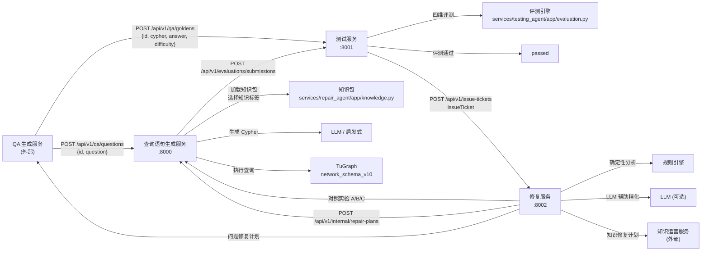

# Text2Cypher 闭环系统架构说明

> 说明：本文档基于当前仓库中的实际实现整理，描述三服务闭环架构中每个模块在代码中的落地位置。
>
> 完整的系统规划参见 `docs/PLAN.md`。

## 1. 整体架构

系统包含三个内部 Python + FastAPI 服务和两个外部服务（仅定义接口契约）：

## 2. 架构图与当前代码的对应关系

### 2.1 查询语句生成服务

| 架构能力 | 代码位置 |
|---|---|
| FastAPI 入口 | `services/query_generator_agent/app/main.py` |
| 工作流编排 | `services/query_generator_agent/app/service.py` |
| 生成器 | `services/query_generator_agent/app/clients.py` → `OpenAICompatibleCypherGenerator` / `QwenGeneratorClient` |
| LLM 生成器 | `services/query_generator_agent/app/clients.py` → `OpenAICompatibleCypherGenerator` |
| 自动回退客户端 | `services/query_generator_agent/app/clients.py` → `QwenGeneratorClient` |
| 测试服务客户端 | `services/query_generator_agent/app/clients.py` → `TestingServiceClient` |
| SQLite 存储 | `services/query_generator_agent/app/repository.py` |
| 配置 | `services/query_generator_agent/app/config.py` |
| Web 控制台 | `services/query_generator_agent/app/ui/` |

REST 接口：
- `POST /api/v1/qa/questions` — 接收 QA 问题
- `GET /api/v1/questions/{id}` — 查询执行状态
- `POST /api/v1/internal/repair-plans` — 接收修复计划
- `GET /api/v1/generator/status` — 查看生成器配置
- `GET /api/v1/tugraph/connection-test` — TuGraph 连接测试

### 2.2 测试服务

| 架构能力 | 代码位置 |
|---|---|
| FastAPI 入口 | `services/testing_agent/app/main.py` |
| 评测编排 | `services/testing_agent/app/service.py` |
| 修复服务客户端 | `services/testing_agent/app/clients.py` → `RepairServiceClient` |
| SQLite 存储 | `services/testing_agent/app/repository.py` |
| 配置 | `services/testing_agent/app/config.py` |
| Web 控制台 | `services/testing_agent/app/ui/` |

REST 接口：
- `POST /api/v1/qa/goldens` — 接收标准答案
- `POST /api/v1/evaluations/submissions` — 接收查询执行结果
- `GET /api/v1/evaluations/{id}` — 查询评测状态
- `GET /api/v1/issues/{ticket_id}` — 获取问题单

### 2.3 问题修复服务

| 架构能力 | 代码位置 |
|---|---|
| FastAPI 入口 | `services/repair_agent/app/main.py` |
| 修复分析引擎 | `services/repair_agent/app/service.py` → `RepairService` |
| 确定性分析 | `services/repair_agent/app/service.py` → `_deterministic_analysis()` |
| 对照实验 | `services/repair_agent/app/service.py` → `_run_counterfactuals()` |
| 对照实验归因 | `services/repair_agent/app/service.py` → `_apply_counterfactuals()` |
| LLM 辅助精化 | `services/repair_agent/app/clients.py` → `OpenAICompatibleRepairPlanner` |
| 修复计划分发 | `services/repair_agent/app/clients.py` → `DispatchClient` |
| SQLite 存储 | `services/repair_agent/app/repository.py` |
| 配置 | `services/repair_agent/app/config.py` |
| Web 控制台 | `services/repair_agent/app/ui/` |

REST 接口：
- `POST /api/v1/issue-tickets` — 接收问题单并生成修复计划
- `GET /api/v1/repair-plans/{plan_id}` — 获取修复计划

### 2.4 共享模块

| 模块 | 代码位置 | 用途 |
|---|---|---|
| 数据模型 | `contracts/models.py` | Pydantic 模型定义，全系统共用 |
| 评测引擎 | `services/testing_agent/app/evaluation.py` | 四维评测逻辑 |
| 知识包 | `services/repair_agent/app/knowledge.py` | 默认知识包、知识标签选择、schema hint 构建 |
| Schema 画像 | `services/testing_agent/app/schema_profile.py` | `network_schema_v10` 的 context 和 hints |
| TuGraph 客户端 | `services/testing_agent/app/tugraph.py` | TuGraph REST 调用（支持 mock 模式） |

## 3. REST 接口总览

| 方向 | 接口 | 说明 |
|---|---|---|
| QA → 查询生成 | `POST /api/v1/qa/questions` | 提交自然语言问题 |
| QA → 测试 | `POST /api/v1/qa/goldens` | 提交标准答案 |
| 查询生成 → 测试 | `POST /api/v1/evaluations/submissions` | 提交查询执行结果 |
| 测试 → 修复 | `POST /api/v1/issue-tickets` | 提交问题单 |
| 修复 → 查询生成 | `POST /api/v1/internal/repair-plans` | 分发修复计划 |
| 修复 → QA (外部) | 待实现 | 问题相关修复计划 |
| 修复 → 知识运营 (外部) | 待实现 | 知识相关修复计划 |

## 4. 核心数据对象

### IssueTicket
测试服务产出的问题单，包含：
- `ticket_id`, `id`, `difficulty`, `question`
- `expected`：标准 Cypher 和标准答案
- `actual`：实际生成的 Cypher 和执行结果
- `knowledge_context`：本次使用的知识标签
- `evaluation`：四维评测结果（verdict, dimensions, symptom, evidence）

### RepairPlan
修复服务产出的修复计划，包含：
- `plan_id`, `ticket_id`, `id`
- `root_cause`：`generator_logic_issue` / `knowledge_gap_issue` / `qa_question_issue` / `mixed_issue` / `unknown`
- `confidence`：置信度 0.0-1.0
- `actions`：修复动作列表，每个指定 `target_service` + `action_type` + `instruction`
- `counterfactuals`：对照实验结果（如果执行了）
- `state`：`analyzing` → `counterfactual_checking` → `repair_plan_created` → `dispatched`

## 5. 问题分析工作流

### 第一层：确定性规则分析

修复服务先做确定性检查，按优先级归因：

1. **问题歧义 + question_alignment=fail** → `qa_question_issue`
2. **知识标签未覆盖期望概念** → `knowledge_gap_issue`
3. **语法错误或 schema 不对齐** → `generator_logic_issue`
4. **结果+问题对齐同时失败** → `mixed_issue`
5. **证据不足** → `unknown`

### 第二层：对照实验（仅 mixed/unknown/knowledge_gap 时触发）

- **实验 A**：相同问题 + 相同知识 → 重新生成
- **实验 B**：相同问题 + 扩展知识 → 重新生成
- **实验 C**：澄清问题 + 相同知识 → 重新生成

归因逻辑：
- A 成功 → `generator_logic_issue`
- B 成功 A 失败 → `knowledge_gap_issue`
- C 成功 A 失败 → `qa_question_issue`
- 全部失败 → 保持 `unknown`

## 6. 当前代码目录与架构模块的对照表

| 架构模块 | 当前目录 | 当前状态 |
|---|---|---|
| 查询语句生成服务 | `services/query_generator_agent/` | ✅ 已实现 |
| 测试服务 | `services/testing_agent/` | ✅ 已实现 |
| 问题修复服务 | `services/repair_agent/` | ✅ 已实现 |
| 共享模型 | `contracts/models.py` | ✅ 已实现 |
| 评测引擎 | `services/testing_agent/app/evaluation.py` | ✅ 已实现 |
| 知识包 | `services/repair_agent/app/knowledge.py` | ✅ 已实现 |
| Schema 画像 | `services/testing_agent/app/schema_profile.py` | ✅ 已实现 |
| TuGraph 客户端 | `services/testing_agent/app/tugraph.py` | ✅ 已实现（支持 mock） |
| QA 生成服务 | 外部 | ⏳ 仅定义接口契约 |
| 知识运营服务 | 外部 | ⏳ 仅定义接口契约 |

## 7. 一句话总结

当前实现已将 PLAN.md 中的三服务闭环架构完整落地：

- **查询语句生成服务**负责接收问题 → 加载知识 → 生成 Cypher → 执行 TuGraph → 提交结果
- **测试服务**负责接收标准答案 + 查询结果 → 四维评测 → 产出问题单
- **修复服务**负责接收问题单 → 确定性分析 → 对照实验 → 生成修复计划 → 分发
- 暂时仍为 mock / 待实现的有：QA 生成服务、知识运营服务、真实 TuGraph（默认 mock 模式）
