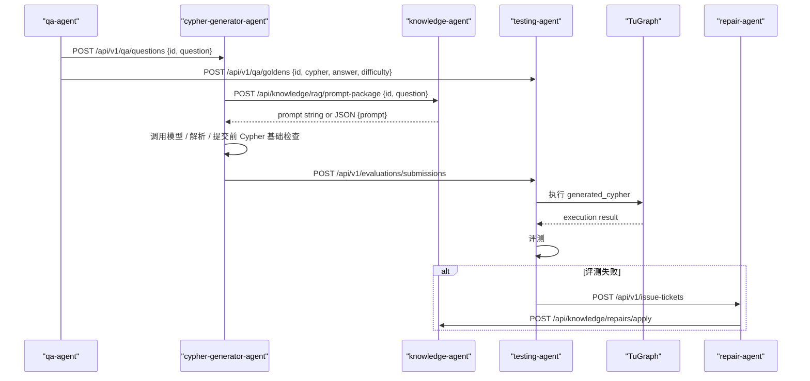

# Workflow Design

## 当前生效的系统工作流

系统按 `id` 这一主键串联三个内部服务与两个外部角色：

- `cypher-generator-agent`
- `testing-agent`
- `repair-agent`
- `qa-agent`（外部）
- `knowledge-agent`（外部）

## 角色分工

### cypher-generator-agent

输入：
- 外部服务发送的 `id + question`

负责：
- 接收问题
- 向 `knowledge-agent` 主动获取 prompt package
- 调用模型生成 Cypher
- 解析输出并做提交前 Cypher 基础检查
- 保留内部生成运行事实，并向 testing-agent 提交最小 submission 契约
- 向 `testing-agent` 提交生成结果

不负责：
- 设计 Prompt
- 执行 TuGraph
- 判断业务是否答对

### testing-agent

输入：
- `id + cypher + answer + difficulty` 的 Golden Answer
- `cypher-generator-agent` 提交的 `generated_cypher + generation evidence`

负责：
  - 存储 Golden Answer
  - 存储生成结果
  - 分配并维护 `attempt_no`
  - 执行 TuGraph
  - 生成 `grammar -> execution -> strict compare -> semantic review -> EvaluationSummary`
  - 失败时创建 `IssueTicket`
  - 持久化供 repair-agent 展示的最小生成证据与 prompt snapshot
  - 向 `repair-agent` 提交问题单

### repair-agent

输入：
- `testing-agent` 提交的 `IssueTicket`
- `IssueTicket` 中携带的最小生成证据与 prompt snapshot

负责：
- 根因分析
- 必要的对照实验
- 生成 `KnowledgeRepairSuggestionRequest`
- 向 `knowledge-agent` 投递知识修复建议

## 核心数据流

### 数据流 A：问题输入

- qa-agent -> cypher-generator-agent
- `POST /api/v1/qa/questions`
- 请求体：

```json
{
  "id": "qa-001",
  "question": "查询网络设备及其端口信息"
}
```

### 数据流 B：提示词获取

- cypher-generator-agent -> knowledge-agent
- `POST /api/knowledge/rag/prompt-package`
- 请求体：

```json
{
  "id": "qa-001",
  "question": "查询网络设备及其端口信息"
}
```

- 响应：

```text
knowledge-agent 当前正式契约是返回可直接用作上下文材料的 prompt 文本。
```

### 数据流 C：Golden Answer

- qa-agent -> testing-agent
- `POST /api/v1/qa/goldens`

### 数据流 D：生成结果提交

- cypher-generator-agent -> testing-agent
- `POST /api/v1/evaluations/submissions`
- 请求体：

```json
{
  "id": "qa-001",
  "question": "查询网络设备及其端口信息",
  "generation_run_id": "run-001",
  "generated_cypher": "MATCH (ne:NetworkElement)-[:HAS_PORT]->(p:Port) RETURN ne.name, p.name LIMIT 10",
  "input_prompt_snapshot": "请只返回 cypher 字段"
}
```

- 响应体：

```json
{
  "accepted": true
}
```

### 数据流 E：问题单提交

- testing-agent -> repair-agent
- `POST /api/v1/issue-tickets`

### 数据流 F：知识修复建议投递

- repair-agent -> knowledge-agent
- `POST /api/knowledge/repairs/apply`
- 说明：repair-agent 以 testing-agent 问题单中的最小生成证据为诊断输入，诊断记录持久化在 repair-agent 自身存储中；运行中心读取 testing-agent submission、IssueTicket 和 repair-agent 分析记录做汇总展示

## 时序图



## 当前状态语义

### cypher-generator-agent

`cypher-generator-agent` 只维护“生成阶段处理状态”：

- `submitted_to_testing`
- `generation_failed`
- `service_failed`

说明：
- `submitted_to_testing` 不等于业务通过
- 最终业务通过/失败由 `testing-agent` 给出
- `parse_summary`、`preflight_check` 和 `raw_output_snapshot` 仍然存在，但它们属于 cypher-generator-agent 内部运行事实，不属于跨服务 submission 契约

### testing-agent

- `received_golden_only`
- `received_submission_only`
- `ready_to_evaluate`
- `repair_pending`
- `repair_submission_failed`
- `issue_ticket_created`
- `passed`

## 说明

如果需要更细的 `cypher-generator-agent` 边界、字段定义和接口示例，请以
[cypher-generator-agent-design.md](/Users/mangowmac/Desktop/code/NL2Cypher/services/cypher_generator_agent/docs/cypher-generator-agent-design.md)
为准。
