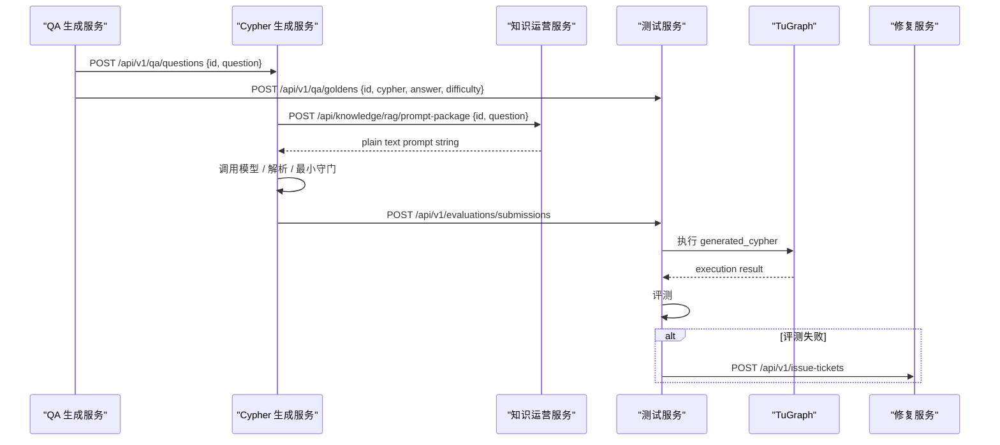

# Workflow Design

## 当前生效的系统工作流

系统按 `id` 这一主键串联三个内部服务与两个外部角色：

- `Cypher Generation Service`（Cypher 生成服务）
- `Testing Service`（测试服务）
- `Repair Service`（修复服务）
- `QA 生成服务`（外部）
- `知识运营服务`（外部）

## 角色分工

### Cypher Generation Service（Cypher 生成服务）

输入：
- 外部服务发送的 `id + question`

负责：
- 接收问题并落盘
- 向知识运营服务主动获取 `generation_prompt`
- 调用模型生成 Cypher
- 解析输出并做最小守门
- 保留 `input_prompt_snapshot` 与 `raw_output_snapshot`
- 向测试服务提交生成结果
- 接收修复计划回执

不负责：
- 设计 Prompt
- 执行 TuGraph
- 判断业务是否答对

### Testing Service（测试服务）

输入：
- `id + cypher + answer + difficulty` 的 Golden Answer
- 生成服务提交的 `generated_cypher + generation evidence`

负责：
- 存储 Golden Answer
- 存储生成结果
- 执行 TuGraph
- 做四维评测
- 失败时创建 `IssueTicket`
- 向修复服务提交问题单

### Repair Service（修复服务）

输入：
- 测试服务提交的 `IssueTicket`

负责：
- 根因分析
- 必要的对照实验
- 生成 `RepairPlan`
- 分发修复计划

## 核心数据流

### 数据流 A：问题输入

- QA 生成服务 -> 生成服务
- `POST /api/v1/qa/questions`
- 请求体：

```json
{
  "id": "qa-001",
  "question": "查询网络设备及其端口信息"
}
```

### 数据流 B：提示词获取

- 生成服务 -> 知识运营服务
- `POST /api/knowledge/rag/prompt-package`
- 请求体：

```json
{
  "id": "qa-001",
  "question": "查询网络设备及其端口信息"
}
```

- 响应体：

```text
请只返回 cypher 字段
```

说明：

- `prompt-package` 的正式返回规格是纯文本提示词字符串
- 不存在 JSON `prompt` 包装格式
- 如果返回 JSON，对 CGS 来说应视为契约违规

### 数据流 C：Golden Answer

- QA 生成服务 -> 测试服务
- `POST /api/v1/qa/goldens`

### 数据流 D：生成结果提交

- 生成服务 -> 测试服务
- `POST /api/v1/evaluations/submissions`
- 请求体：

```json
{
  "id": "qa-001",
  "question": "查询网络设备及其端口信息",
  "generation_run_id": "run-001",
  "generated_cypher": "MATCH (ne:NetworkElement)-[:HAS_PORT]->(p:Port) RETURN ne.name, p.name LIMIT 10",
  "parse_summary": "parsed_json",
  "guardrail_summary": "accepted",
  "raw_output_snapshot": "",
  "input_prompt_snapshot": "请只返回 cypher 字段"
}
```

### 数据流 E：问题单提交

- 测试服务 -> 修复服务
- `POST /api/v1/issue-tickets`

## 时序图



## 当前状态语义

### 生成服务

生成服务只维护“生成阶段处理状态”：

- `received`
- `prompt_fetch_failed`
- `prompt_ready`
- `model_invocation_failed`
- `output_parsing_failed`
- `guardrail_rejected`
- `submitted_to_testing`
- `failed`

说明：
- `submitted_to_testing` 不等于业务通过
- 最终业务通过/失败由测试服务给出

### 测试服务

- `received_golden_only`
- `waiting_for_golden`
- `ready_to_evaluate`
- `passed`
- `issue_ticket_created`

## 说明

如果需要更细的 Cypher 生成服务边界、字段定义和接口示例，请以
[Cypher_Generation_Service_Design.md](/Users/mangowmac/Desktop/code/NL2Cypher/services/query_generator_agent/docs/Cypher_Generation_Service_Design.md)
为准。
